# SU120で自由なレイアウトを作成するには

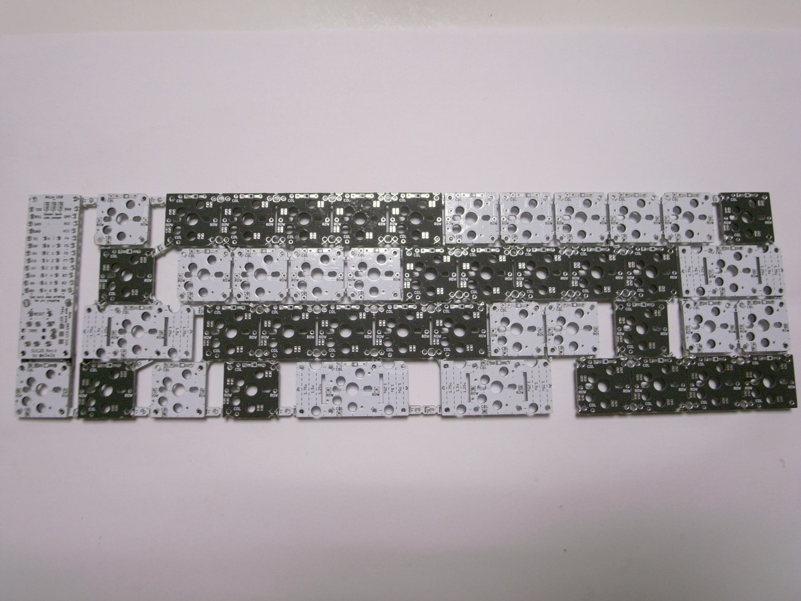


SU120では基板間をビスケットで接続することである程度自由なキー配置が可能です。注意点をまとめておきます。

## 配置できるキー数の上限

ロータリーエンコーダー無しの場合、Pro Micro1つにつき最大6行10列=60キーを配置できます。


2つのPro MicroをTRRSケーブルで接続することにより、片側60キー、合計120キーの分割キーボードとして使えます。


DuplexMatrixとして配線することで、さらに倍の240キーまで利用可能となりますが、ここでは説明を割愛します。

ロータリーエンコーダーを使う場合、ロータリーエンコーダー1つにつき2つのピンを使うため、キー配置に使えるピンがその分減ります。

具体的には、Pro Micro1つに対しロータリーエンコーダーを2つ配置する場合、最大6行6列=36キーを配置できます。

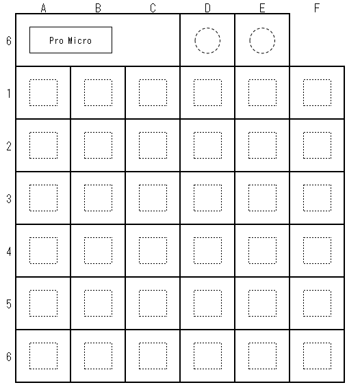

Pro Micro1つに対しロータリーエンコーダーを1つ配置する場合、最大6行8列=48キーを配置できます。

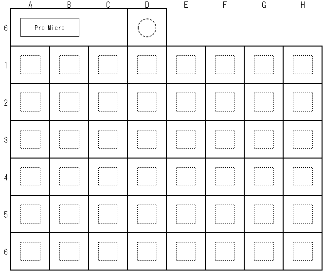

なお、この行と列は配線上のものであり、例えば6行6列を下図のように組むことで、レイアウト上は3行12列とすることも可能です。


## 基板をつなぐネジ

基板をつなぐネジはM1.4ネジを使用します。皿ネジではなく、基板との接地面が大きい鍋ネジなどを使ってください。

ネジ長5mmのM1.4ネジとM1.4ナットを併用するのが確実です。

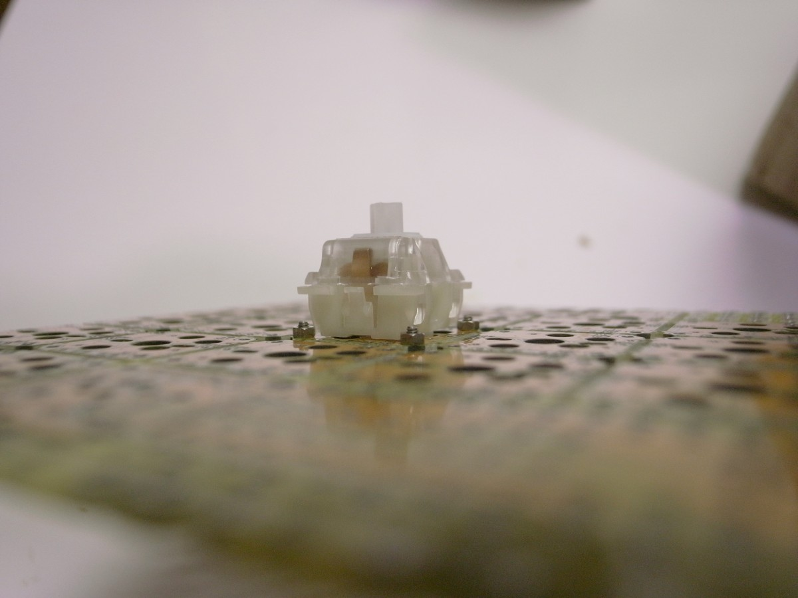

ネジの調達先によっては、ナット無しでネジ長3mmのM1.4ネジだけで固定できることがあります。ネジ長3mmの場合、基板からはみ出しません。


今のところの経験則は以下のとおりです。

- ウィルコ、ヒロスギのM1.4ネジは、基板の穴に対してネジが太めで、ネジ留めが固く、ネジだけで組める。
- ウィルコはM1.4ナットがかなり高い（100個買う場合で税抜単価92円）。ヒロスギはM1.4ナットがラインナップにない。

- Aliexpressの100本で1ドル台の安いM1.4ネジは、ネジが若干細めで、しっかり組むにはM1.4ナットも合わせて調達したほうがよい。

- 一度の発注で届く10枚の基板の中でも微妙な個体差があり、ネジ留めがきつかったりゆるかったりする。

そのため、個人的には以下のようにしています。

- 届くまで2～3週間待てるときは、Aliexpressでネジ長5mmのM1.4ネジとM1.4ナットを買う。足りなくなるとまた届くまで時間がかかるので、必要な数の2倍買う。
- 2～3週間待ちたくないときは、ウィルコ、ヒロスギでネジ長3mmのM1.4ネジを買う。
- とにかく固く頑丈にしたいときは、ウィルコ、ヒロスギでネジ長5mmのM1.4ネジを買い、ナット無しで仮組みする。別途AliexpressでM1.4ナットを発注し、後日ナットを付けて締める。

## ビスケット

カットした基板を繋ぐために使う部品です。

基板の外周に配置されています。カット位置に線を入れてありますので、ここをニッパーで切ってください。小さいパーツなので、飛んでいかないように手を添えてください。


ビスケットのネジ穴はキースイッチを配置する部分の四隅、キースイッチを配置する19.05mm角の四角の頂点から縦横1/8(2.38125mm)だけ内側にあります。


キースイッチに干渉しないように、基板の裏側から取り付けます。


linearと書いてあるビスケットは、格子配列や横に並んだキー配列など、直線で接続する場合に使います。

staggerと書いてあるビスケットは、Row-Staggered、Column-Staggeredなど、ずらして接続する場合に使います。

例えば、格子配列の場合、縦横方向の結合に1u linearを使い、筋交い用に0.25u staggerを使います。

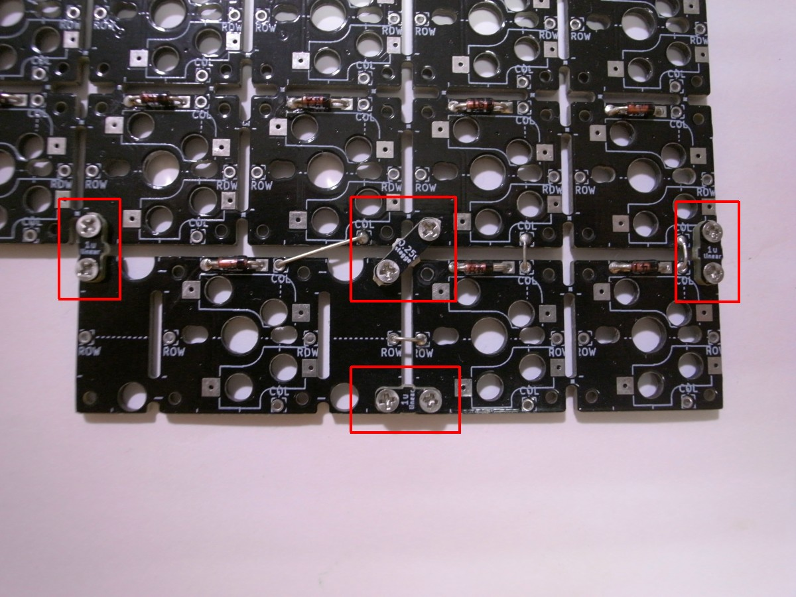

詳しくは以下の表をご覧ください。基板4枚で60%キーボードレイアウト（US、JIS）が可能となるように数量を設計してあります。

| 印字 |   |   | 数量 | 概要 | 接続例（赤丸同士を接続） |
| ------------ | ------------------------------------------------------ | ---- | ---------------- | ---------------- | ---------------- |
| 1u linear    |  |  | 5 | 1U間を接続 | <br /> |
| 1.25u linear |  |   | 2 | 1Uと1.25Uを接続 |  |
| 1.5u linear<br />1u linear |  |  | 1 | 1Uと1.5Uを接続<br />1.25U同士を接続<br />切れ目で切り離すと1u linearとして使える | 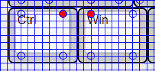<br /> |
| 2u linear<br />1.5u linear<br />1u linear |  |  | 1 | 1Uとスタビライザー無しの2Uを接続<br />0.5U空けたキー配置にも使用<br />切れ目で切り離すと1.5u linearまたは1u linearとして使える | 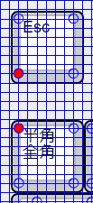<br /> |
| 1/8u stagger    |  |  | 6    | 1Uを0.125u(1/8u)ずらして接続 | 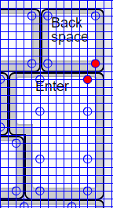<br /> |
| 0.25u stagger    |  |  | 4    | 1Uを0.25u(1/4u)ずらして接続<br />1Uを0.5u(1/2u)ずらして接続する場合にも使用<br />格子配列の斜め方向の筋交いにも使用 | <br />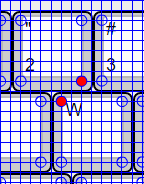 |
| 3/8u stagger    |  |  | 1    | 1Uを0.375u(3/8u)ずらして接続 | 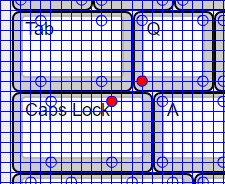<br /> |
| 0.5u stagger<br />0.25u stagger    |  |  | 1 | 1Uを0.5u(1/2u)ずらして接続<br />切れ目で切り離すと0.25u staggerとして使える |  |
| 5/8u stagger<br />3/8u stagger    |  |  | 1 | 1Uを0.625u(5/8u)ずらして接続<br />切れ目で切り離すと3/8u staggerとして使える |  |
| 0.75u stagger<br />3/8u stagger |  |  | 1 | 1Uを0.75u(3/4u)ずらして接続<br />切れ目で切り離すと3/8u staggerとして使える |  |

## キーマトリクスの配線

基板をビスケットで繋いだあと、縦横のキーマトリクスの配線を繋ぎます。

縦方向はCOLと印字されたスルーホール（例えば、下図の赤色のマル印）が導通するようにします。

横方向も同様に、ROWと印字されたスルーホール（例えば、下図の青色のマル印）が導通するようにします。

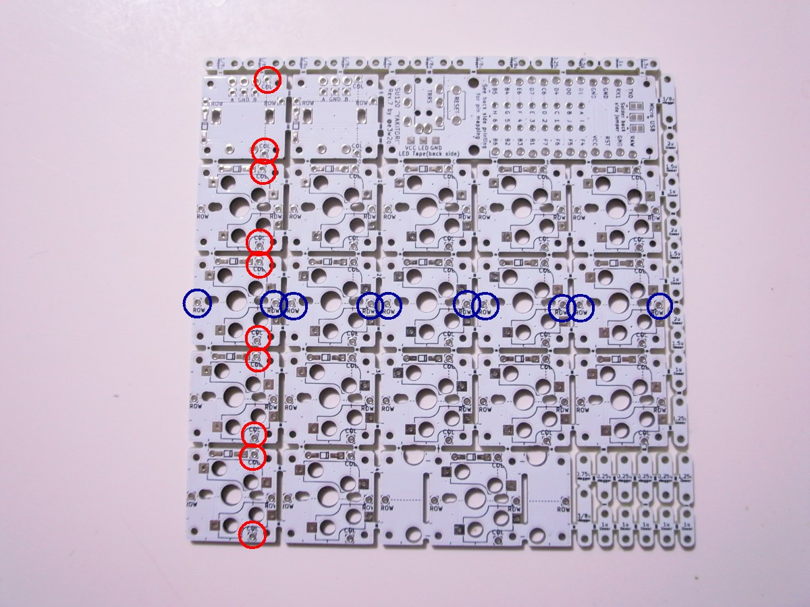

格子配列や近いところの接続であれば、ダイオードの足の切れ端を折り曲げてはんだ付けするのが楽です。

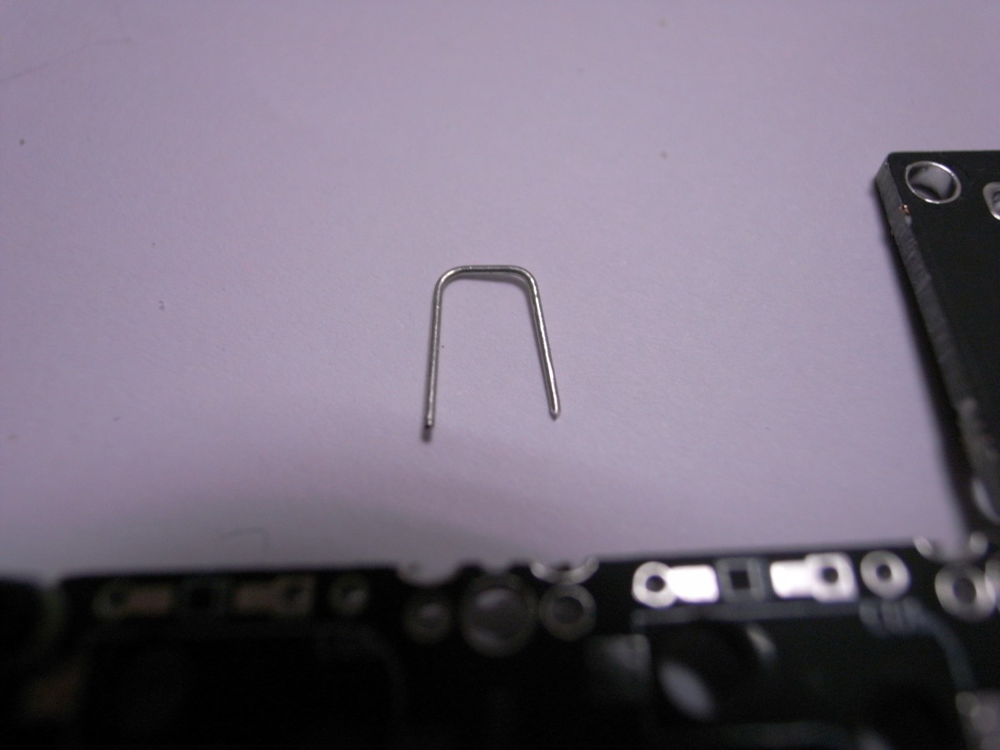


## Pro Microとキーマトリクスとを接続する配線

キーマトリクスの導通が確認できたら、次はPro Microとキーマトリクスを接続します。まず、基板の表を見てください。

基板の表側から見て、横は最大10キーで、左からA B C D E F G H I J、縦は最大6キーで、上から1 2 3 4 5 6となります。ロータリーエンコーダー2個を使う場合は、横は最大6キーとなります。ロータリーエンコーダー1個を使う場合は、横は最大8キーとなります。


名前の付け方は、Microsoft Excelの番地と同じです。


基板を裏返して、Pro Micro裏のシルク印刷の番地と該当行・該当列をポリウレタン銅線（UEW線）などで結線します。このとき、Pro Microと該当行・該当列は、どのスルーホールに繋いでもよいです。

例えば、Pro MicroのCという印字のスルーホール（オレンジ色の四角）と繋ぐのは、C列のスルーホール（オレンジ色のマル）のどれでも構いません。

Pro Microの3という印字のスルーホール（青色の四角）と繋ぐのは、3行目のスルーホール（青色のマル）のどれでも構いません。

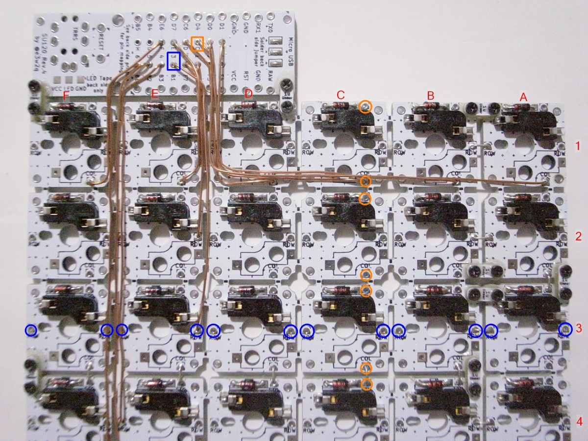

なお、基板の状態で、Pro Microとキーとは、以下の番地となるように配線済みです。


裏側（イメージ）


基板を連結して拡張する場合は、拡張した行及び列と、Pro Microとの結線が必要となります。

ロータリーエンコーダー2つの場合、最大で6行6列なので右に1列（F列まで）、下は既存の4行目を折り割って、6行まで拡張可能です。これに必要な基板は3枚であり、例えば赤矢印の部分を結線します。ロータリーエンコーダーのプッシュボタンには6D、6Eを割り当ててあるため、プッシュボタンと6D、6Eのキーは同じ挙動となります。

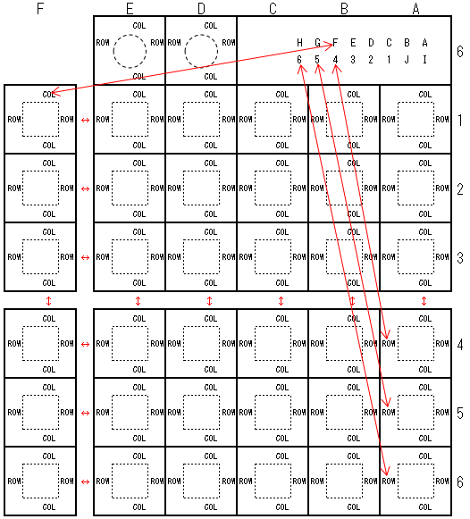

ロータリーエンコーダーが1つのとき、最大で6行8列なので右に3列（H列まで）、下は既存の4行目を折り割って、6行まで拡張可能です。これに必要な基板は4枚であり（細かく繋げば3枚でも可能）、例えば赤矢印の部分を結線します。

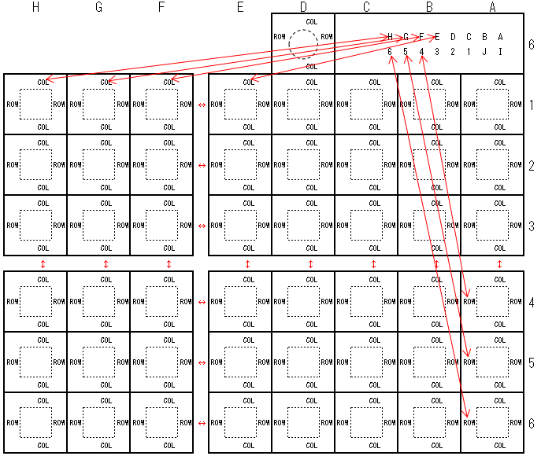

ロータリーエンコーダー無しのとき、最大で6行10列なので右に5列（J列まで）、下は既存の4行目を折り割って、6行まで拡張可能です。これに必要な基板は4枚であり、例えば赤矢印の部分を結線します。


配線には、ポリウレタン銅線などを使ってください。

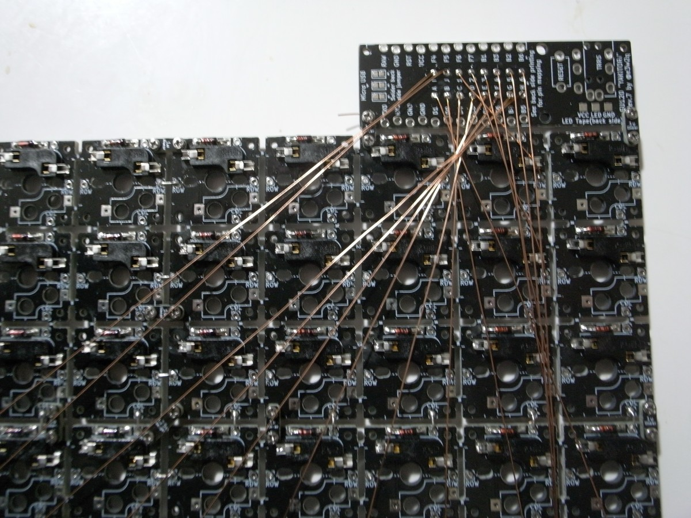

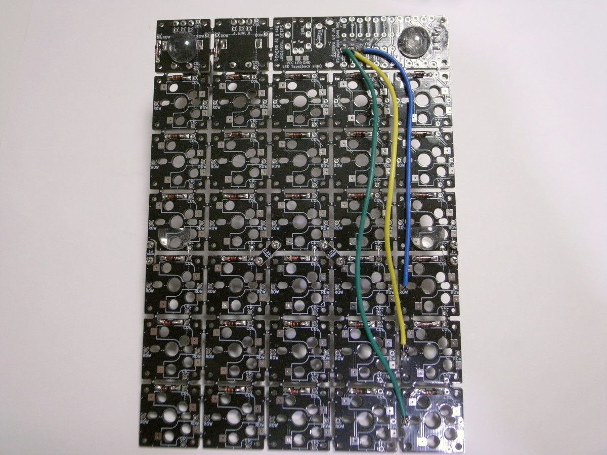

## ファームウェア

以下のリンク先を参考にして、QMK Firmwareのビルド環境を用意します。

- [Getting Started - QMK Firmware](https://docs.qmk.fm/#/newbs_getting_started)

ビルド環境構築時に持ってくるQMK Firmwareは、フォークした[https://github.com/e3w2q/qmk_firmware/tree/su120](https://github.com/e3w2q/qmk_firmware/tree/su120)とします。または、本家を持ってきて、そこに[https://github.com/e3w2q/qmk_firmware/tree/su120/keyboards/handwired/su120](https://github.com/e3w2q/qmk_firmware/tree/su120/keyboards/handwired/su120)以下をコピーしてもよいです。

デフォルトキーマップを書き込むには、qmk_firmwareのフォルダに移動し、ロータリーエンコーダーの数に合わせて以下を実行します。

- ロータリーエンコーダーなし
```
make handwired/su120/rev1:default:avrdude  
```
- ロータリーエンコーダー2個（右手1個、左手1個）
```
make handwired/su120/rev1_2knob:default:avrdude  
```
- ロータリーエンコーダー4個（右手2個、左手2個）
```
make handwired/su120/rev1_4knob:default:avrdude  
```

デフォルトキーマップのほかに、テスト用のキーマップを用意しています。

テスト用のキーマップでは、入力したキーの論理的な配置（例えば1行目A列のキーなら「A1」）が入力されます。スレーブ側の入力は頭に「S」が付きます。ロータリーエンコーダーは回すと「1ST_ENC_R」「1ST_ENC_L」などが入力されます。

[KeyboardTester.com](https://www.keyboardtester.com/tester.html)等を使わずに全キーの入力テストを行う際にご利用ください。

- ロータリーエンコーダーなし
```
make handwired/su120/rev1:test:avrdude  
```
- ロータリーエンコーダー2個（右手1個、左手1個）
```
make handwired/su120/rev1_2knob:test:avrdude  
```
-  ロータリーエンコーダー4個（右手2個、左手2個）
```
make handwired/su120/rev1_4knob:test:avrdude  
```
**Detecting USB port, reset your controller now...** と表示されたらPro Micro横のリセットスイッチを押すと書き込みが始まります。

