# 120 Key Split Ortholinear Keyboard 

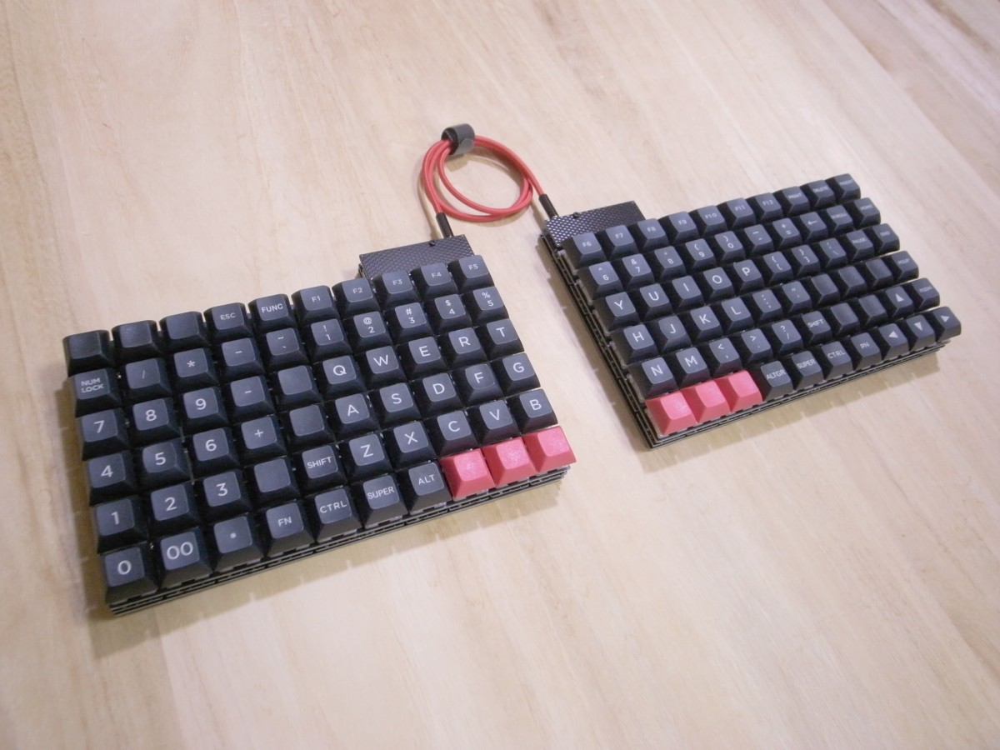

## 必要なパーツ
| 名前 | 数 | 備考 | 調達先の例 | 参考価格（送料込） |
|:-|:-|:-|--|--|
| SU120 基板 | 8枚 | [入手方法はこちら](../common/pcb_order_guide_jp.md) | [Elecrow Online store](https://www.elecrow.com/) | 10枚で1,400円($12.94) |
| SU120 120キー格子配列分割キーボード用プレート | 4枚 | [入手方法はこちら](../common/pcb_order_guide_jp.md) | [Elecrow Online store](https://www.elecrow.com/) | 5枚で3,200円($29.78) |
| Pro Micro | 2個 | スルーホールをZigzag仕様にしてあるのでコンスルーではなく普通の付属ピンヘッダを使います | [AliExpress](https://www.aliexpress.com/)で「Pro Micro ATmega32U4 5V 16MHz」を検索 | 580円($2.66×2) |
| タクトスイッチ 2本足のもの | 2個 | | https://ja.aliexpress.com/item/1068908059.html | 50個で100円($0.90) |
| 3.5mm4極ミニジャック | 2個 | 秋月電子型番:MJ-4PP-9<br>マルツ型番:GB-35J-4CW-BM<br>AliExpress:PJ-320A | https://ja.aliexpress.com/item/32874772300.html | 10個で110円($0.99) |
| ダイオード 1N4148 | 120個 | ハンダ付けの難易度は上がりますが表面実装ダイオード(1N4148W)も可 | https://ja.aliexpress.com/item/32729204179.html | 200個で180円($0.80×2) |
| Kailh PCBソケット CherryMX用 または Choc用 | 120個 | | https://yushakobo.jp/shop/a01ps/ | 1,980円+送料330円 |
| 5ピン仕様のキースイッチ CherryMX用 または Choc用 | 120個 |  | https://yushakobo.jp/product-category/switches/ | 5,280円～ |
| キーキャップ CherryMX用 または Choc用 | 120個 |  | https://www.aliexpress.com/item/32852927837.html Product properties: All in One 145 keys<br />不足キー分 https://ja.aliexpress.com/item/32851511530.html | 4,680円($43.11)<br />340円($3.15) |
| クッションゴム | 8個 |  | ダイソー クッションゴム 14個入り または すべりどめシート | 110円 |
| M1.4ネジ 5mm長 | 44本 |  | https://ja.aliexpress.com/item/32948746653.html | 100本で130円($1.27) |
| M1.4ナット | 44個 | | https://ja.aliexpress.com/item/32883596896.html | 50個で190円($1.80) |
| ポリウレタン銅線 |  | | https://ja.aliexpress.com/item/32628455799.html | 1mで100円($0.85) |
| M2ネジ | 24個 | | https://ja.aliexpress.com/item/32987012317.html | 50個で150円($1.34) |
| M2スペーサー3mm長 メス-オス | 12個 | メス-オス：片側がネジになっているもの | https://ja.aliexpress.com/item/33033691154.html | 50個で120円($1.10) |
| M2スペーサー3mm長 メス-メス | 8個 | メス-メス：両側にネジ穴が切ってあるもの | https://ja.aliexpress.com/item/33033691154.html | 50個で120円($1.10) |
| M2スペーサー6mm長 メス-メス | 4個 | メス-メス：両側にネジ穴が切ってあるもの | https://ja.aliexpress.com/item/33033691154.html | 50個で240円($2.20) |
| Micro USBケーブル | 1本 | 通信ができるもの | ダイソー | 110円 |
| TRRSケーブル | 1本 | AUXオーディオ接続コード | ダイソー | 110円 |
| 計 |  |  |  | 19,560円 |

## 使用する道具、消耗品

[使用する道具、消耗品](../common/tool_guide_jp.md)を参照ください。

## ビルドガイド

### Pro Microのもげ防止加工

Pro Microにエポキシ接着剤を盛って、簡単にはもげないようにします。

参考1:[ProMicroのモゲ防止ついでにQMK_Firmwareを書き込む - Qiita](https://qiita.com/hdbx/items/2f3e4ddfcadda2a5578e)
参考2:[もげ予防 - Self-Made Keyboards in Japan](https://scrapbox.io/self-made-kbds-ja/%E3%82%82%E3%81%92%E4%BA%88%E9%98%B2)

エポキシ接着剤の2液を混ぜます。


接着剤を付け始める前にMicro USBコネクタを横から見てください。側面に穴が開いています。この穴に接着剤が入ると端子が入らなくなったり、入りにくくなったりします。


この穴を避けて、つまようじなどで接着剤を盛っていきます。


乾くまで置いておきます。

### 基板のカット

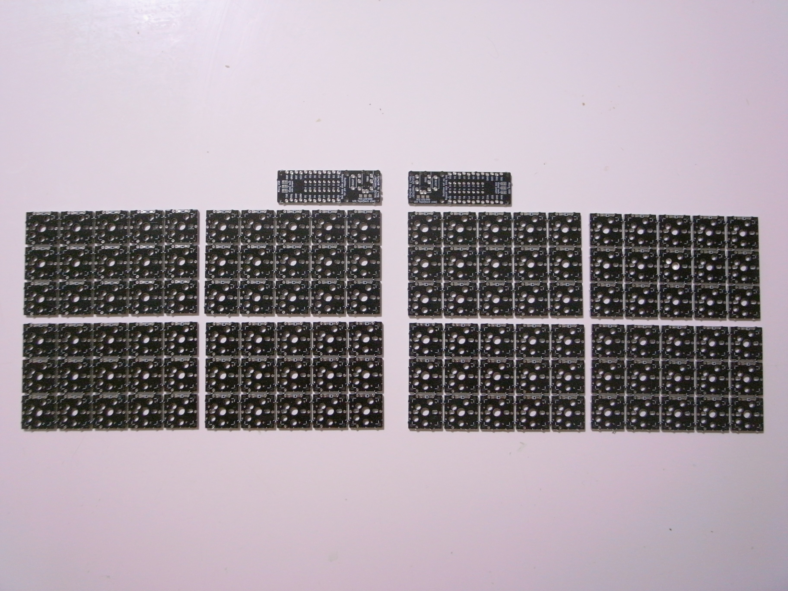

最終的に上の図のようにカットします。

まず基板端のビスケットをニッパーで切断します。切ってよい場所は印を付けているので、印の付いているところだけ切断してください。

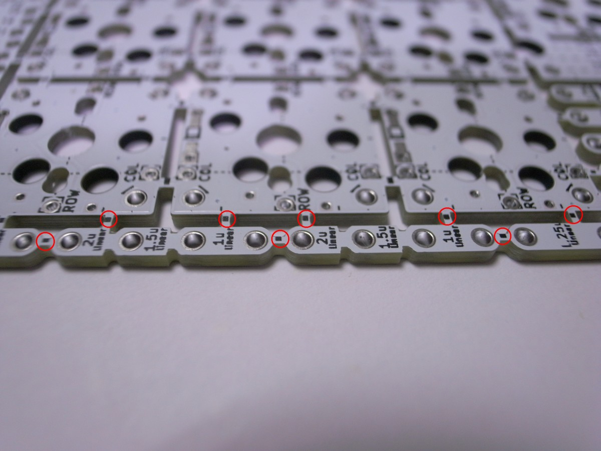

次に、不要な部分をカットします。

ニッパーで表裏に切れ目を入れてから折り割ってください。

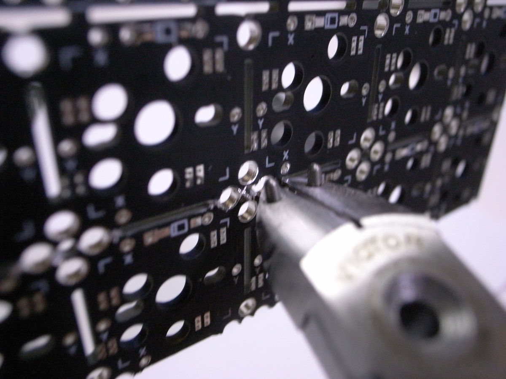

### プレートのカット

下図の赤枠の部分をカットしたものを2つ、カットしないものを2つ用意します。

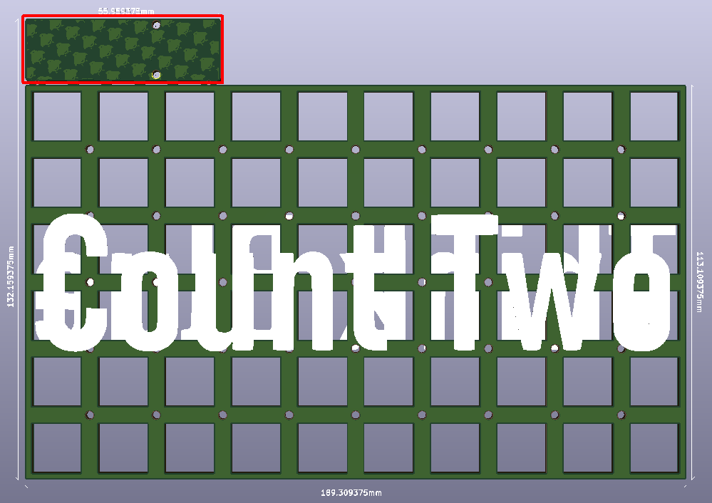

### 基板側面のヤスリがけ

机に紙ヤスリを置き、その上で基板とプレートのカットした側面をヤスリがけします。粗目だけでもそこそこきれいになります。お好みで細目までかけてもよいです。


### 基板の結合

M1.4ネジとビスケットで基板を結合させます。

下図の赤色の部分には1u linear、青色の筋交いの部分には0.25u staggerと書いてあるビスケットを使います。

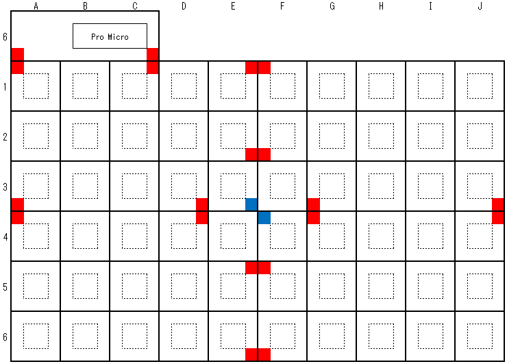

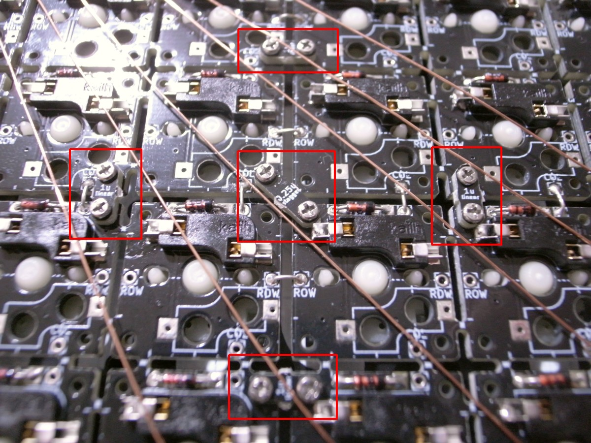

基板の裏からネジ止めし、ナットを締めます。


### ダイオードの取り付け

各キースイッチの端の120箇所にダイオードを取り付けます。

キースイッチの枠が描いてあるほうが基板の表で、Kailh PCBソケットの枠が描いてあるほうが裏です。

ダイオードは、以下の理由で基板の裏に付けることを推奨します。

- スタビライザーを装着するキースイッチそばのダイオードを表側に付けるとスタビライザーと干渉する。

- ロープロファイルスイッチでトッププレートを付けたい場合はダイオードを表側に付けると干渉する

なお、ロープロファイルスイッチでトッププレートを付けたい場合は、ダイオードの表側に出た足をカットしてからハンダ付けするか、表面実装ダイオードを裏面で使ってください。

ダイオードの足は、指で根本付近を曲げます。はじめに1つだけダイオードを曲げて穴に差し込んでみて、うまくいく曲げ具合を確認して残りのダイオードを同じように曲げてください。

ダイオードの黒くなっている側が、基板の図の二重線の側になるように差し込みます。


全てのダイオードを配置した後、マスキングテープで浮かないようにカバーしておきます。

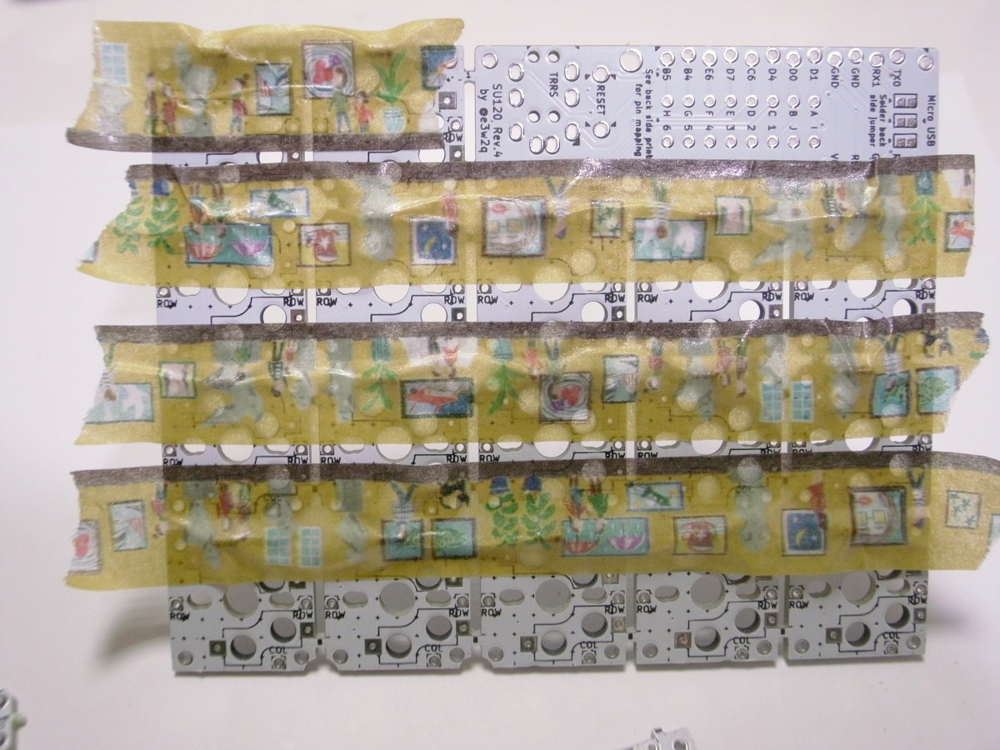

基板をひっくり返してダイオードを全てハンダ付けし、ニッパーで足を切ります。ダイオードの足を切ってからハンダ付けしても構いません。私はハンダ付けのときに周りの足が邪魔なのと、後がきれいになるので、最近はカットしてからハンダ付けするようにしています。

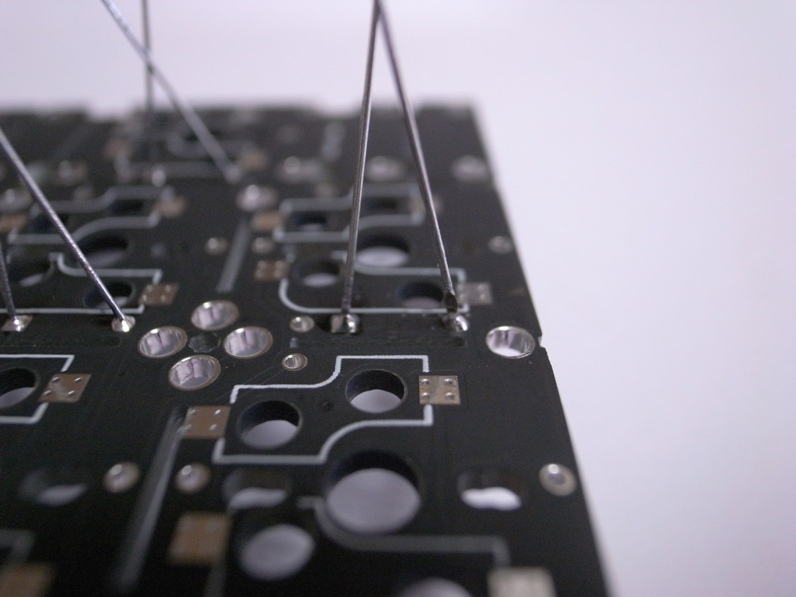

### PCBソケットの取り付け

基板の裏の印刷された枠に合うようにPCBソケットを配置します。
CherryMX用のPCBソケットを置く場合は、間違った向きに置かないように注意してください。間違った向きに取り付けるとあとでキースイッチが入りません。


PCBソケット両端の金属部分をハンダ付けします。

ハンダ付け不良のリスクを減らすために、事前に片側のみハンダを盛る→ソケットを置いて、ハンダごてで押し付ける→反対側をはんだ付けする、という手順がおすすめです。


### GNDのジャンパ

基板の裏側のジャンパ3箇所をハンダ付けします。**表側にもジャンパがありますが、裏側のみハンダ付けします**。


ハンダを盛ってから間を繋ぐのですが、うまくいかない場合はダイオードの切れ端を使って繋いでも構いません。

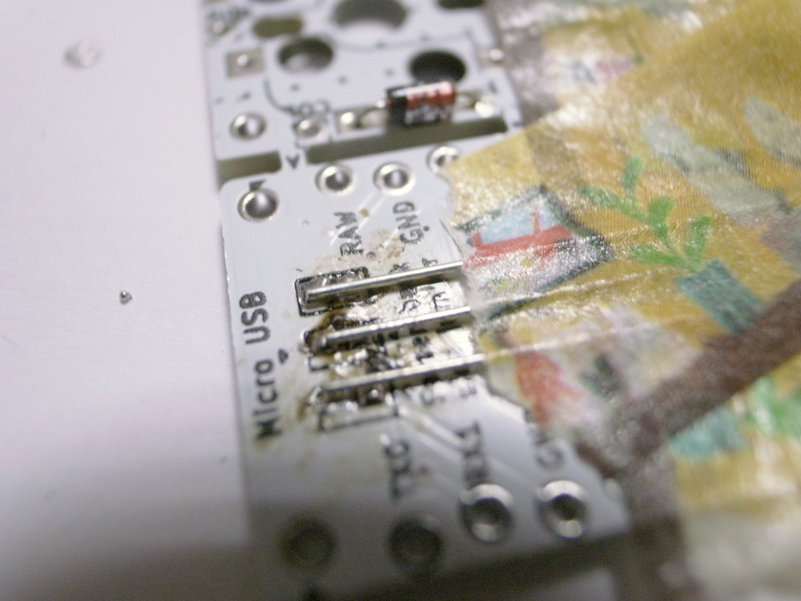


### リセットスイッチの取り付け

基板の表側からタクトスイッチをはめ込みます。


裏返してハンダ付けします。

### Pro Microの取り付け

基板の表側のPro Micro設置部分の2箇所に、Pro Microに付属している12ピンのピンヘッダの短い側を根本まで差し込みます。


スルーホールがジグザグになっているので、少し入れにくくなっています。ゆっくり押し込んでください。

ピンヘッダにPro Microを差し込みます。**Pro Microの裏面（平らなほう）が上になるように、またマイクロUSBが基板端になるように**します。

**向きを間違えるとリカバリーが大変です。表裏、左右をよく確認してください。**

ニッパーでピンヘッダの足を切ってからPro Microとピンヘッダをハンダ付けします。まず四隅をハンダ付けし、横から見てピンヘッダとの間に隙間があれば押さえながらハンダを温めて浮かないようにします。そのあと、順番に全てハンダ付けします。


基板とピンヘッダはジグザグのスルーホールで接触しているため、ハンダ付けは不要です。

次の配線作業の前に、Pro Microを取り外しておきます。

### 配線

基板の裏側を下の図、写真のように配線します。図と写真で配線位置が微妙に違っていますが、結線の際に同じ行・同じ列のスルーホールであれば、どこを使ってもよいためです。ハンダ付けに自信がなければ次項の接続テストをしながらするのもおすすめです。


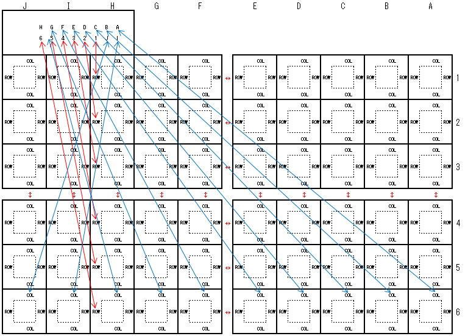

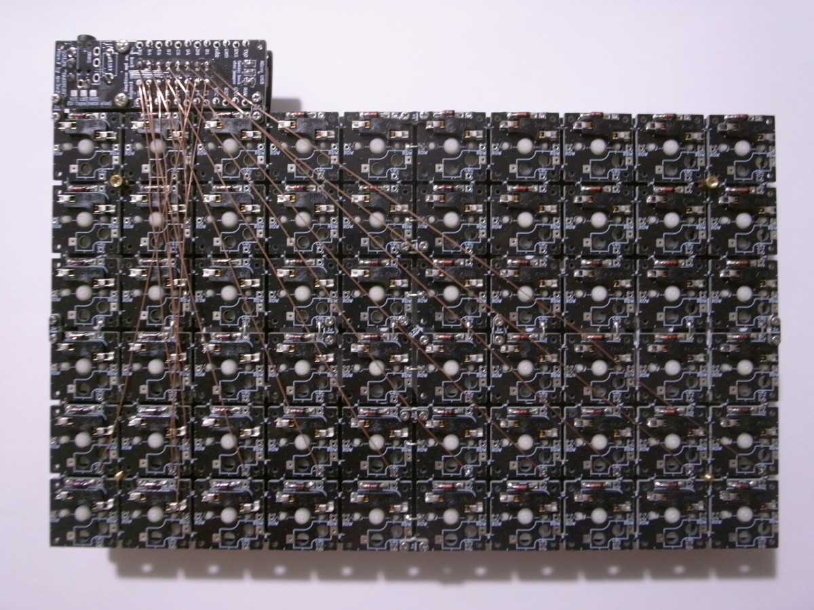

基板間の接続は、ダイオードの足の切れ端を折り曲げてはんだ付けします。


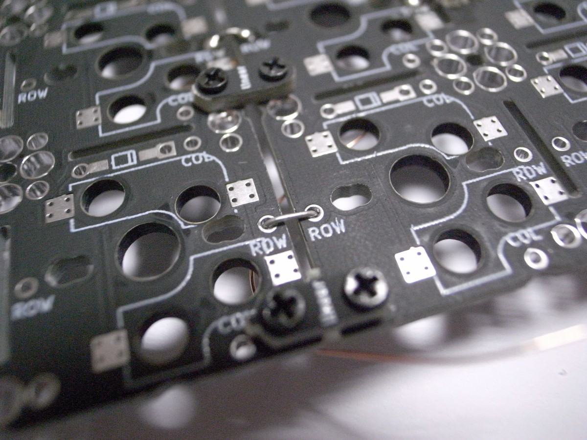

それ以外の接続は、ポリウレタン銅線をハンダごてで加熱し、被膜を焼き切ってからはんだ付けします。下の写真はイメージなので、配線は上図のとおりに行ってください。

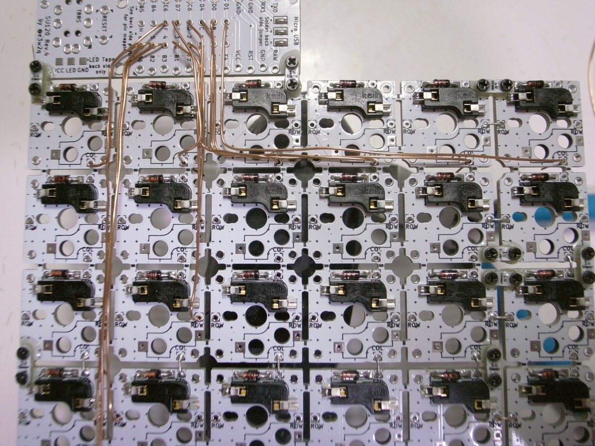

### 配線の接続テスト

配線もれがないか、ポリウレタン銅線がきちんと焼き切れて配線されているかをテスターで確認します。テスターを導通モードにしてください。

A～Jは該当するCOLと、1～6は該当するROWと接続できていればOKです。はんだ付けしたスルーホールでは導通テストをしにくいため、下の写真のように、例えばA列なら青四角同士、1行目なら赤四角同士でテストするのがおすすめです。

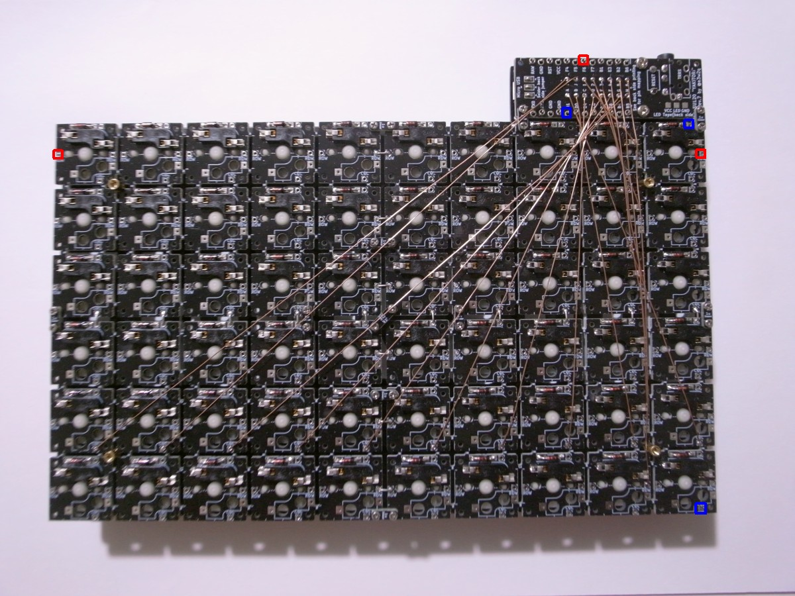

### Pro Microの取り付け

取り外しておいたPro Microを取り付けます。

### プレートの取り付け

下の図のようにネジ、スペーサーを使ってプレートを取り付けます。


### キースイッチの取り付け

表側から差し込みます。キースイッチの足が曲がっている場合はまっすぐにしてから差し込んでください。

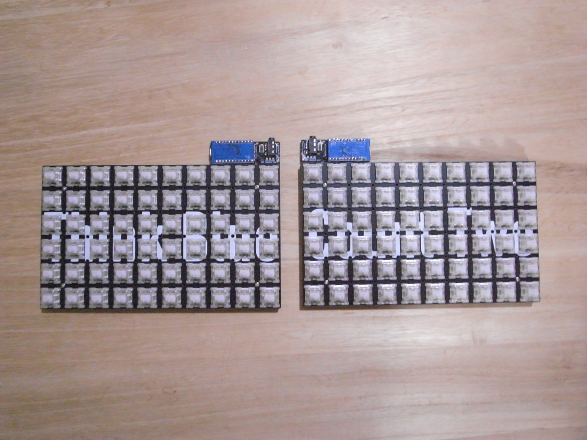

ちょっと引っかかる感じがしたり、他より押し込む力が必要と感じた場合は差し込むのを止めて、キースイッチの足が曲がっていないか確認してください。無理に押し込むと足がUの字に曲がります。

### キーキャップの取り付け

キースイッチにキーキャップをはめます。


### ゴム足の取り付け

ゴム足を裏面に取り付けます。

試打してみて、基板のたわみが気になればゴム足を増やしてください。

### ファームウェアの書き込み

以下のリンク先を参考にして、QMK Firmwareのビルド環境を用意します。
- [Getting Started - QMK Firmware](https://docs.qmk.fm/#/newbs_getting_started)

ビルド環境構築時に持ってくるQMK Firmwareは、フォークした[https://github.com/e3w2q/qmk_firmware/tree/su120](https://github.com/e3w2q/qmk_firmware/tree/su120)とします。または、本家を持ってきて、そこに[https://github.com/e3w2q/qmk_firmware/tree/su120/keyboards/handwired/su120](https://github.com/e3w2q/qmk_firmware/tree/su120/keyboards/handwired/su120)以下をコピーしてもよいです。

デフォルトキーマップを書き込むにはqmk_firmwareのフォルダに移動し、以下を実行します。

```
make handwired/su120/rev1:default:avrdude  
```

**Detecting USB port, reset your controller now...** と表示されたらPro Micro横にハンダ付けしたリセットスイッチを押すと書き込みが始まります。

[KeyboardTester.com](https://www.keyboardtester.com/tester.html)等でキー入力が行えるかテストしてください。