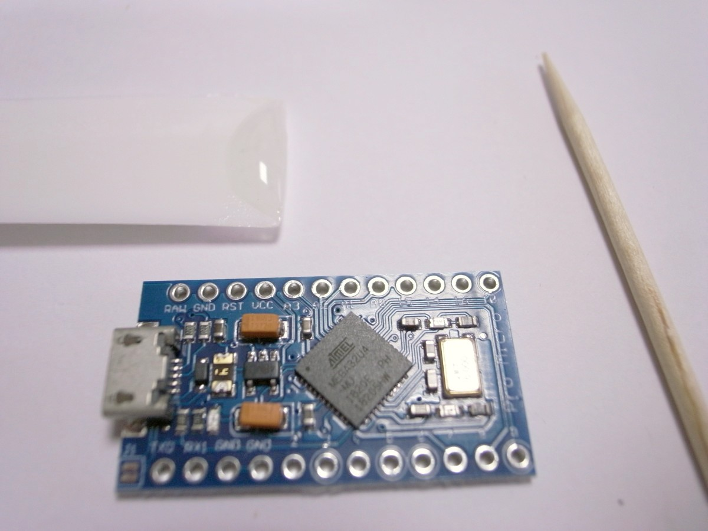
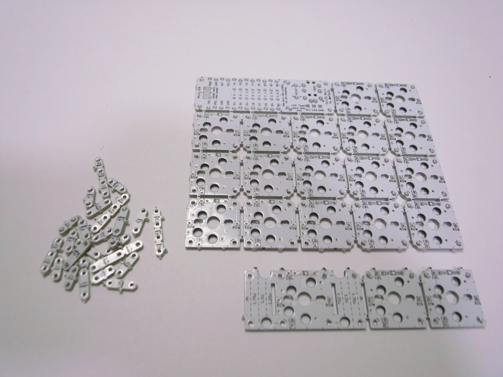
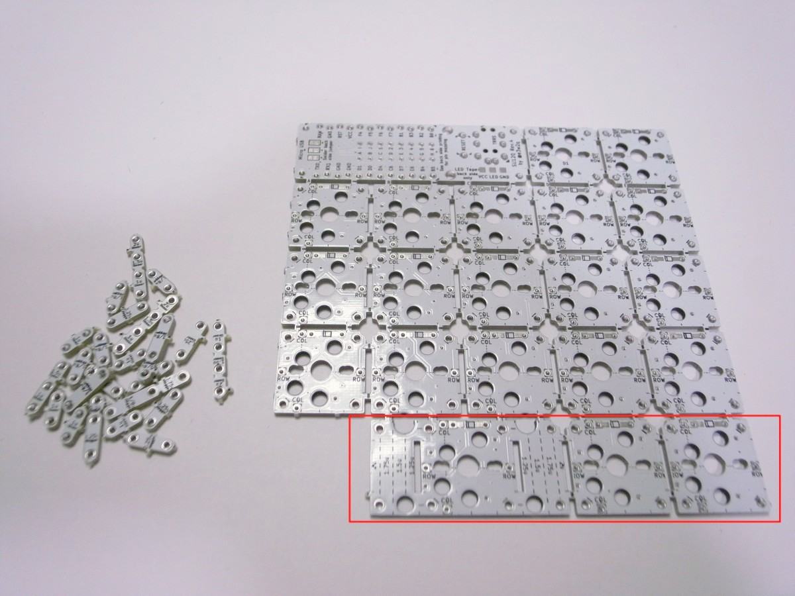
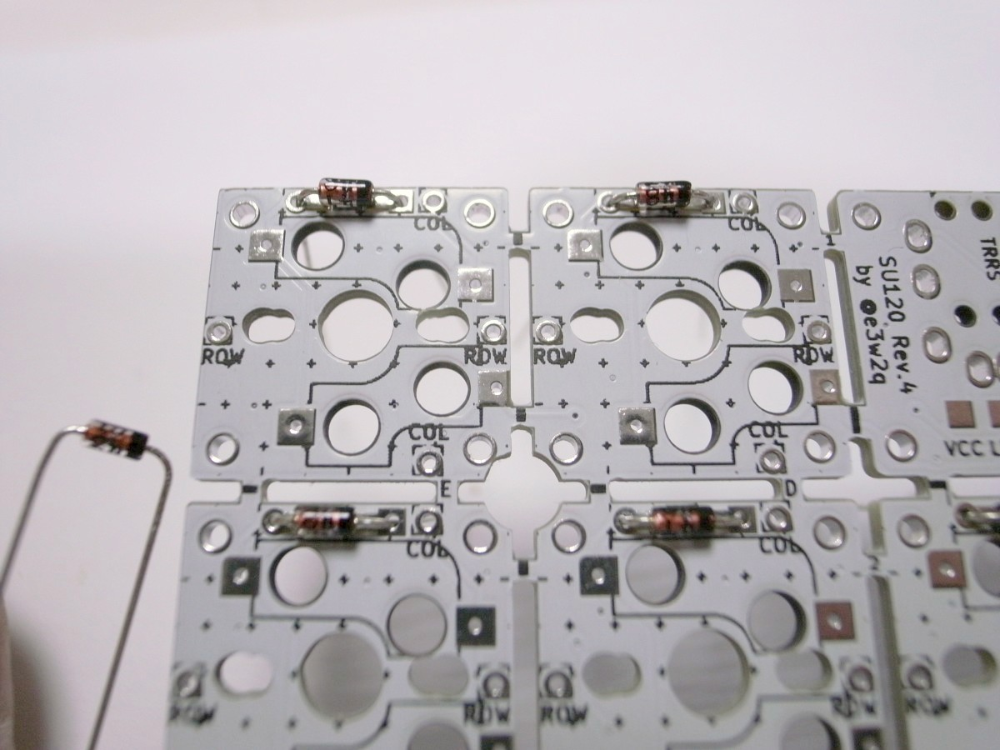
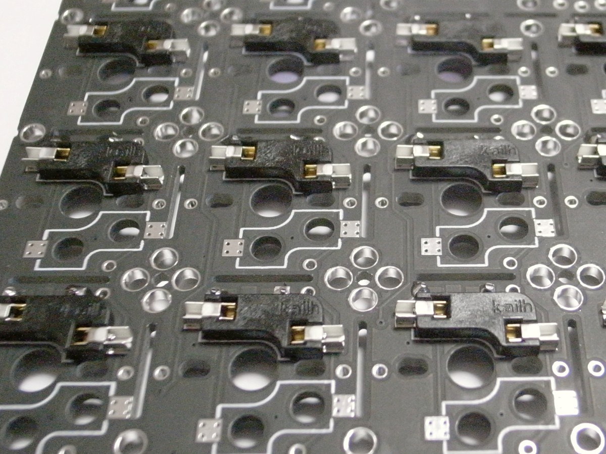
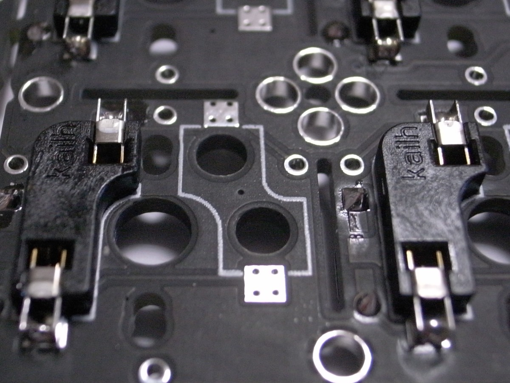
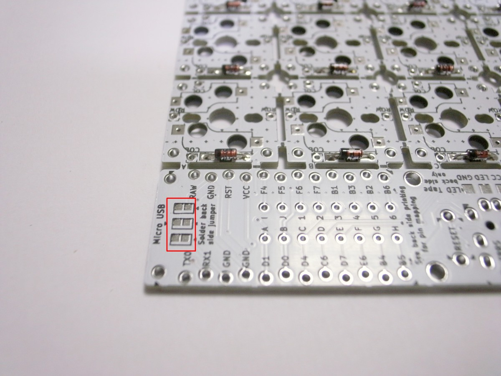
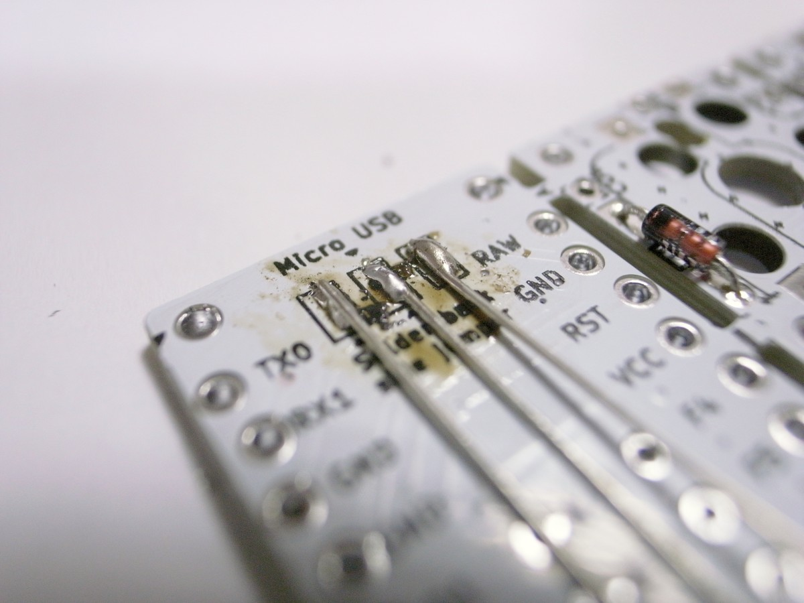
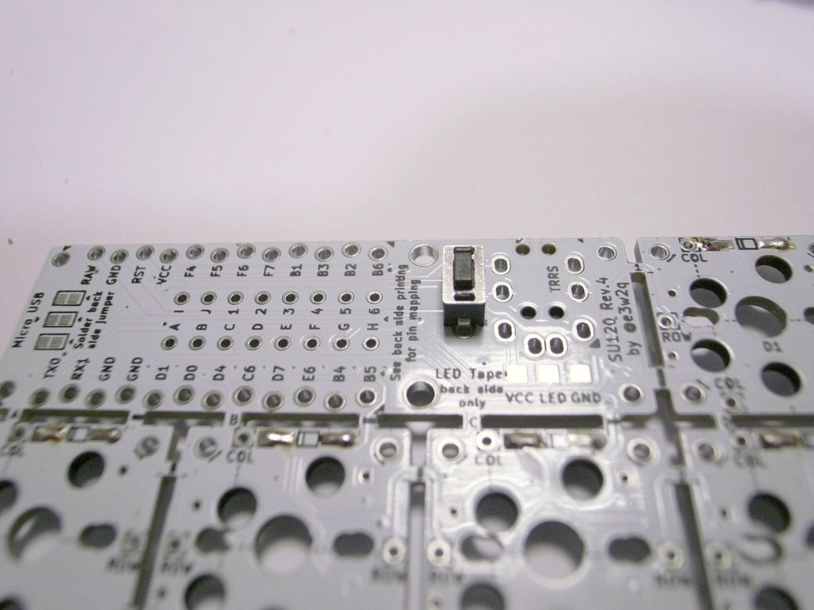
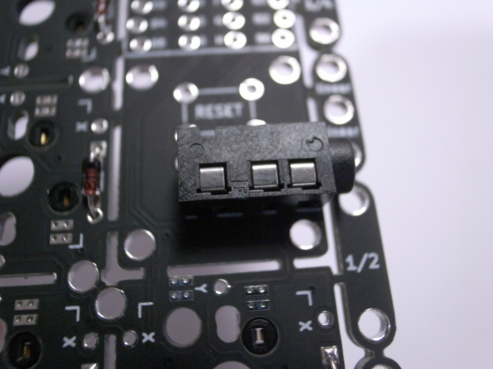

# 34 key split ortholinear keyboard


## 必要なパーツ
| 名前 | 数 | 備考 | 調達先の例 | 参考価格（送料込） |
|:-|:-|:-|--|--|
| SU120 PCB | 2枚 | [入手方法はこちら](../common/pcb_order_guide_jp.md) | [Elecrow Online store](https://www.elecrow.com/) | 10枚で1,400円($12.94) |
| Pro Micro | 2個 | スルーホールをZigzag仕様にしてあるのでコンスルーではなく普通の付属ピンヘッダを使います | [AliExpress](https://www.aliexpress.com/)で「Pro Micro ATmega32U4 5V 16MHz」を検索 | 580円($5.32) |
| タクトスイッチ 2本足のもの | 2個 | | https://www.amazon.co.jp/dp/B00QLTSZK6 | 50個で184円 |
| 3.5mm4極ミニジャック | 2個 | 秋月電子型番:MJ-4PP-9<br>マルツ型番:GB-35J-4CW-BM<br>AliExpress:PJ-320A | https://ja.aliexpress.com/item/32874772300.html | 10個で110円($0.99) |
| ダイオード 1N4148 | 34個 | ハンダ付けの難易度は上がりますが表面実装ダイオード(1N4148W)も可 | https://www.amazon.co.jp/dp/B06WWJ76D7 | 500個で313円 |
| Kailh PCBソケット CherryMX用 または Choc用 | 34個 | | https://yushakobo.jp/shop/a01ps/ | 40個で600円+送料300円 |
| 5ピン仕様のキースイッチ CherryMX用 または Choc用 | 34個 |  | https://yushakobo.jp/product-category/switches/ | 40個で1600円～ |
| キーキャップ CherryMX用 または Choc用 | 34個 |  | CherryMX用 https://ja.aliexpress.com/item/32851511530.html | 40個で680円～($12.40～) |
| クッションゴム | 8個 |  | ダイソー クッションゴム 14個入り または すべりどめシート | 108円 |
| Micro USBケーブル | 1本 | 通信ができるもの | ダイソー | 108円 |
| TRRSケーブル | 1本 | AUXオーディオ接続コード | ダイソー | 108円 |
| 計 |  |  |  | 6,091円                 |

## 使用する道具、消耗品

[使用する道具、消耗品](../common/tool_guide_jp.md)を参照ください。

## ビルドガイド

以下の作業は、右手側と左手側の両方の基板に対して行います。

### Pro Microのもげ防止加工

Pro Microにエポキシ接着剤を盛って、簡単にはもげないようにします。

参考1:[ProMicroのモゲ防止ついでにQMK_Firmwareを書き込む - Qiita](https://qiita.com/hdbx/items/2f3e4ddfcadda2a5578e)
参考2:[もげ予防 - Self-Made Keyboards in Japan](https://scrapbox.io/self-made-kbds-ja/%E3%82%82%E3%81%92%E4%BA%88%E9%98%B2)

エポキシ接着剤の2液を混ぜます。



接着剤を付け始める前にMicro USBコネクタを横から見てください。側面に穴が開いています。この穴に接着剤が入ると端子が入らなくなったり、入りにくくなったりします。


この穴を避けて、つまようじなどで接着剤を盛っていきます。


乾くまで置いておきます。

### 基板のカット



最終的に上の図のようにカットします。

まず基板端のビスケットをニッパーで切断します。印の付いているところだけ切断してください。


次に、不要な行を切断します。



行ごと切断するには、ニッパーで表裏に切れ目を入れてから机の端などで折り割ってください。


### 基板側面のヤスリがけ

机に紙ヤスリを置き、その上で基板の側面をヤスリがけします。粗目だけでもそこそこきれいになります。お好みで細目までかけてもよいです。


### ダイオードの取り付け

各キースイッチの端の17箇所×基板2枚にダイオードを取り付けます。

キースイッチの枠が描いてあるほうが基板の表で、Kailh PCBソケットの枠が描いてあるほうが裏です。

ダイオードは、基板の表と裏、どちら側に付けても構いません。ただし、ロープロファイルスイッチで将来的にトッププレートを付けたい場合は、以下のいずれかを選択してください。

- 基板の裏側にダイオードを付け、表側に出た足をカットしてからハンダ付けする
- 基板の裏側に表面実装ダイオードをハンダ付けする

ダイオードの足は、指で根本付近を曲げます。はじめに1つだけダイオードを曲げて穴に差し込んでみて、うまくいく曲げ具合を確認して残りのダイオードを同じように曲げてください。

ダイオードの黒くなっている側が、基板の図の二重線の側になるように差し込みます。




全てのダイオードを配置した後、マスキングテープで浮かないようにカバーしておきます。


基板をひっくり返してダイオードを全てハンダ付けし、ニッパーで足を切ります。ダイオードの足を切ってからハンダ付けしても構いません。私はハンダ付けのときに周りの足が邪魔なのと、後がきれいになるので、最近はカットしてからハンダ付けするようにしています。


### PCBソケットの取り付け

基板の裏の印刷された枠に合うようにPCBソケットを配置します。
CherryMX用のPCBソケットを置く場合は、間違った向きに置かないように注意してください。間違った向きに取り付けるとあとでキースイッチが入りません。




PCBソケット両端の金属部分をハンダ付けします。



### GNDのジャンパ

基板の裏側のジャンパ3箇所をハンダ付けします。**表側にもジャンパがありますが、裏側のみハンダ付けします**。



ハンダを盛ってから間を繋ぐのですが、うまくいかない場合はダイオードの切れ端を使って繋いでも構いません。




### リセットスイッチの取り付け

基板の表側からタクトスイッチをはめ込みます。



裏返してハンダ付けします。

### ミニジャックの取り付け

基板の表側から4極ミニジャックをはめ込みます。



裏返してハンダ付けします。

### Pro Microの取り付け

基板の表側のPro Micro設置部分の2箇所に、Pro Microに付属している12ピンのピンヘッダの短い側を根本まで差し込みます。


スルーホールがジグザグになっているので、少し入れにくくなっています。ゆっくり押し込んでください。

ピンヘッダにPro Microを差し込みます。**Pro Microの裏面（平らなほう）が上になるように、またマイクロUSBが基板端になるように**します。

**向きを間違えるとリカバリーが大変です。表裏、左右をよく確認してください。**

ニッパーでピンヘッダの足を切ってからPro Microとピンヘッダをハンダ付けします。まず四隅をハンダ付けし、横から見てピンヘッダとの間に隙間があれば押さえながらハンダを温めて浮かないようにします。そのあと、順番に全てハンダ付けします。


基板とピンヘッダはジグザグのスルーホールで接触しているため、ハンダ付けは不要です。

### キースイッチの取り付け

表側から差し込みます。キースイッチの足が曲がっている場合はまっすぐにしてから差し込んでください。


### キーキャップの取り付け

キースイッチにキーキャップをはめます。


### ゴム足の取り付け

ゴム足を裏面に取り付けます。ソケットやキースイッチに接触する場合はハサミで切ってから取り付けます。


試打してみて、基板のたわみが気になればゴム足を増やしてください。

### ファームウェアの書き込み

以下のリンク先を参考にして、QMK Firmwareのビルド環境を用意します。

- Windows
  - [QMKビルド環境の構築(Windows Msys2編)](https://gist.github.com/e3w2q/4bc86e531d1c893d3d13af3e9895a94a)
- macOS
  - [セットアップ - QMK Firmware](https://docs.qmk.fm/#/ja/newbs_getting_started?id=macos)
- Linux
  - [セットアップ - QMK Firmware](https://docs.qmk.fm/#/ja/newbs_getting_started?id=linux)

構築中、

```
qmk setup
```

と入力する代わりに

```
qmk setup e3w2q/qmk_firmware --branch e3w2q
```

と入力してください。

または、`qmk setup`した後に、`C:\Users\USER_NAME\qmk_firmware\keyboards`配下に[https://github.com/e3w2q/qmk_firmware/tree/e3w2q/keyboards/e3w2q](https://github.com/e3w2q/qmk_firmware/tree/e3w2q/keyboards/e3w2q)以下をコピーしてもよいです。

用意されたキーマップを書き込むには以下を実行します。

```
qmk flash -kb e3w2q/su120/rev1 -km default
```

**Detecting USB port, reset your controller now...** と表示されたらPro Micro横にハンダ付けしたリセットスイッチを押すと書き込みが始まります。

右手側、左手側の両方とも書き込みを行ってください。

右手側と左手側をTRRSケーブルで繋ぎ、[KeyboardTester.com](https://www.keyboardtester.com/tester.html)等でキー入力が行えるかテストしてください。