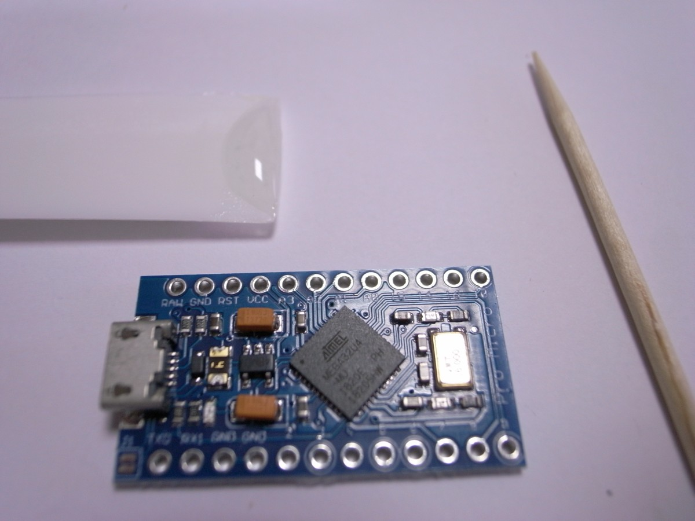
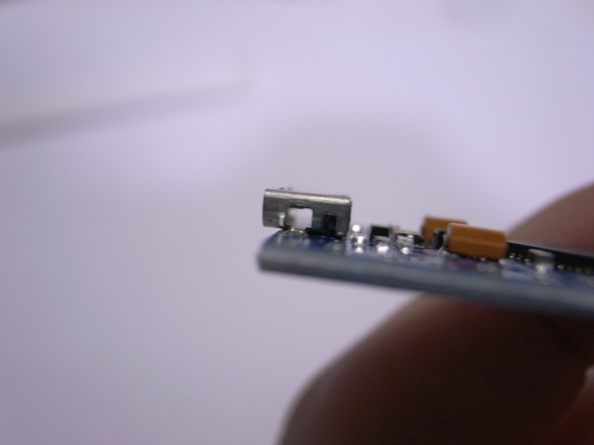
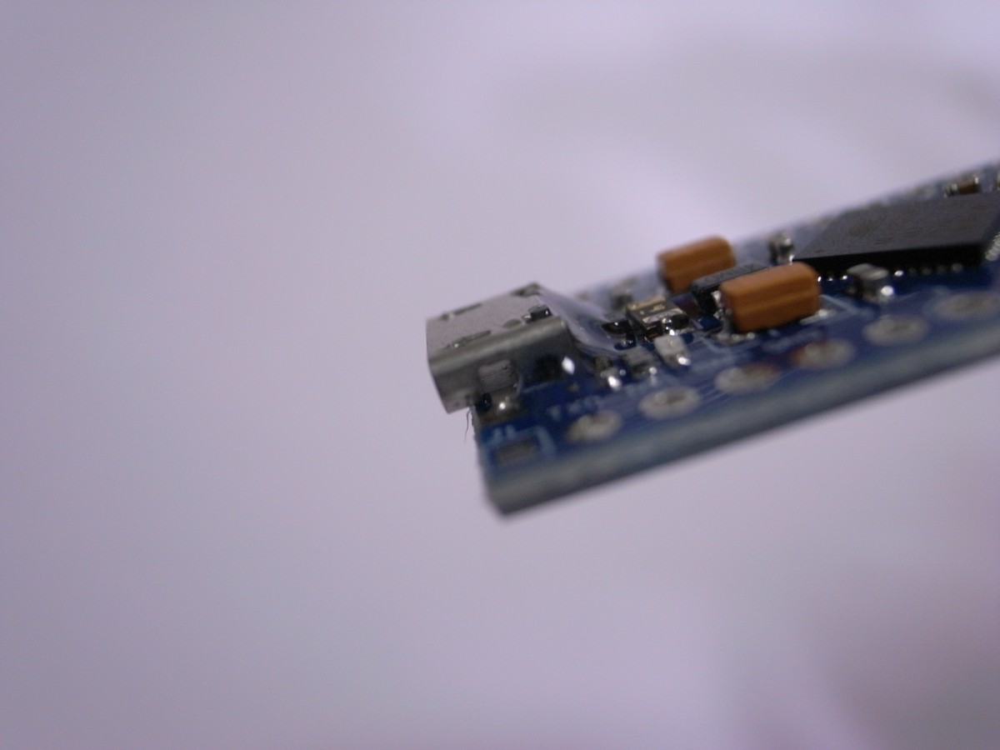
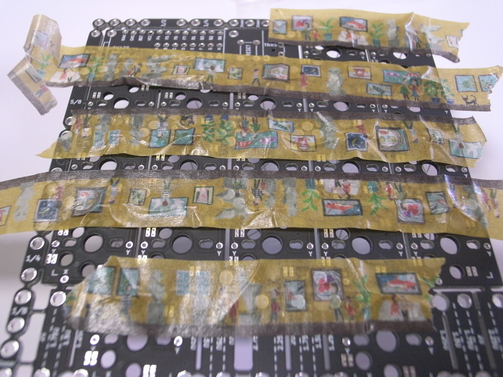
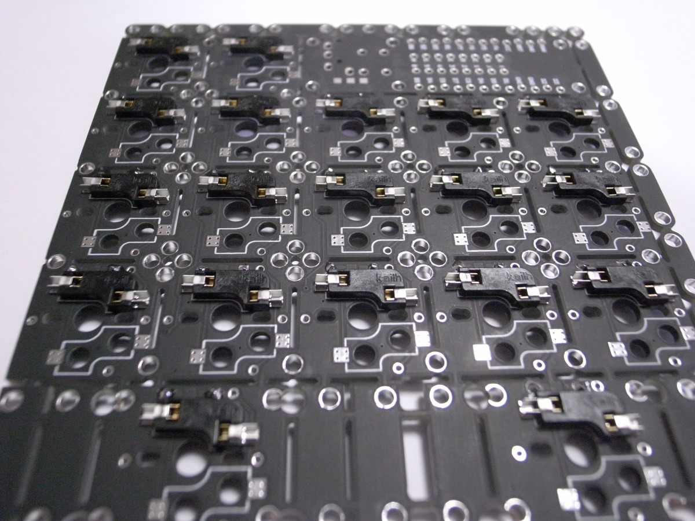
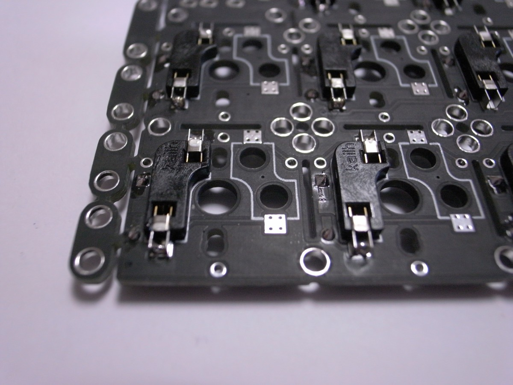
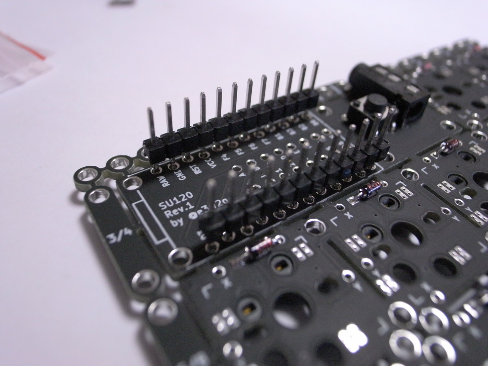
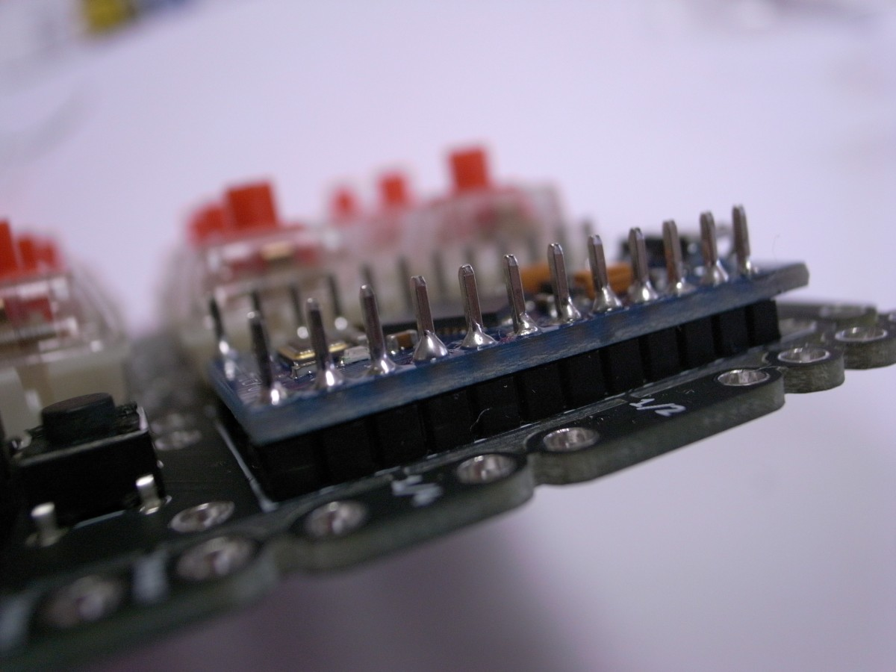
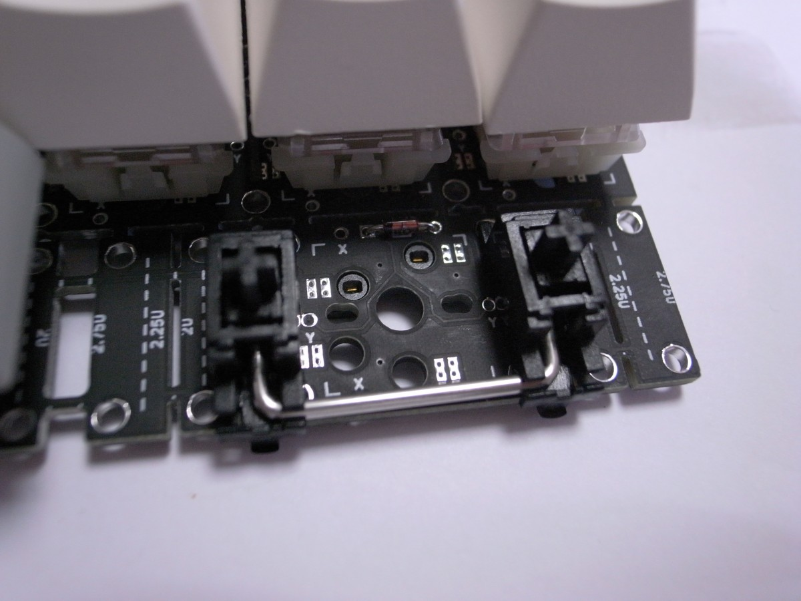
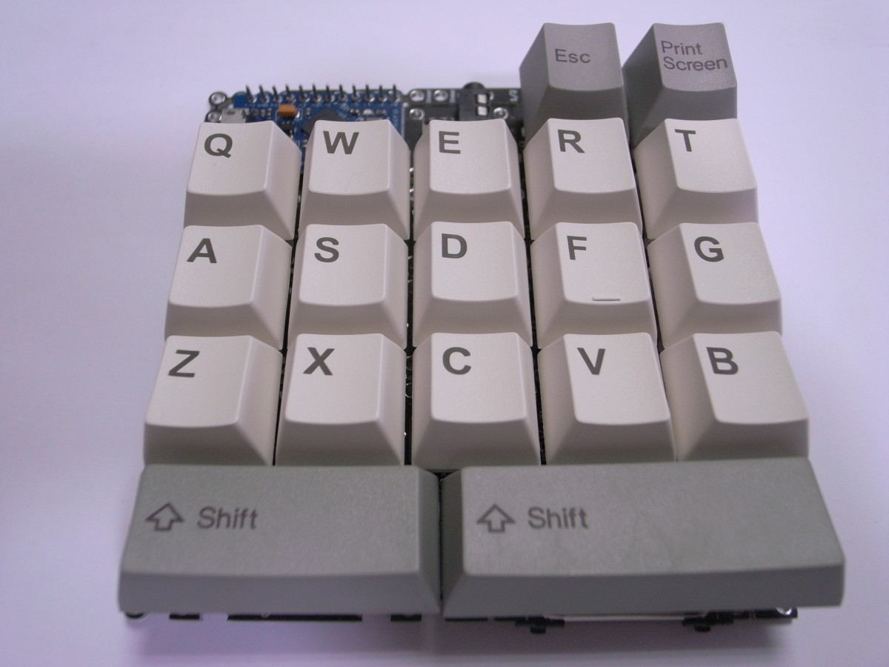

# SU120で作るOne Board Keypad

## 必要なパーツ
<!--- Bill Of Materials -->
| 名前 | 数 | 備考 | 
|:-|:-|:-|
| SU120 PCB | 1枚 | [入手方法はこちら](../common/pcb_order_guide_jp.md) |
| Pro Micro | 1個 | スルーホールをZigzag仕様にしてあるのでコンスルーではなく普通の付属ピンヘッダを使います |
| タクトスイッチ 2本足のもの | 1個 | |
| ダイオード 1N4148 | 19個 | 表面実装タイプも可 |
| LEDテープ お好みの長さ | 1本 | WS2812Bを使用したもの |
| Kailh PCBソケット CherryMX用 または Choc用 | 19個 | |
| 5ピン仕様のキースイッチ CherryMX用 または Choc用 | 19個 | トッププレートがないので3ピン仕様だとガタガタになります |
| キーキャップ CherryMX用 または Choc用 | 19個 | 17個は1U、1個は1U～2.25U、1個は1U～2.75U |
| スタビライザー PCBマウント用 2U | 2個 | 後で付けることも可能なので無いなら無いでOK |
| クッションゴム | 4個以上 | たわみが気になれば増やしてください 適当なものが見つからなければとりあえず100円ショップの滑り止めシートを敷いても |
| Micro USBケーブル | 1本 | |

## 使用する道具類

[SU120で使用する道具、消耗品](../common/tool_guide_jp.md)を参照ください。

## ビルドガイド

### Pro Microのもげ防止加工

Pro Microにエポキシ接着剤を盛って、簡単にはもげないようにします。

参考1:[ProMicroのモゲ防止ついでにQMK_Firmwareを書き込む - Qiita](https://qiita.com/hdbx/items/2f3e4ddfcadda2a5578e)
参考2:[もげ予防 - Self-Made Keyboards in Japan](https://scrapbox.io/self-made-kbds-ja/%E3%82%82%E3%81%92%E4%BA%88%E9%98%B2)

エポキシ接着剤の2液を混ぜます。つまようじを用意します。

接着剤を付け始める前にMicro USBコネクタを横から見てください。側面に穴が開いています。この穴に接着剤が入ると端子が入らなくなったり、入りにくくなったりします。

この穴を避けて、つまようじで接着剤を付けていきます。

乾くまで置いておきます。

### ダイオードの取り付け

19箇所にダイオードを配置します。

基板の表と裏、どちら側に付けても構いません。
なお、キースイッチを配置する枠が描いてあるほうが表で、Kailh PCBソケットを配置する枠が描いてあるほうが裏です。

はじめに1つだけダイオードを曲げて穴に差し込んでみて、うまくいく曲げ具合を見つけて残りのダイオードを同じように曲げておくとやりやすいです。

ダイオードの黒くなっている側が、基板の図の二重線の側になるように差し込みます。

全てのダイオードを配置した後、マスキングテープで浮かないようにカバーしておきます。

基板を裏返して全てハンダ付けします。

ハンダから飛び出ている線を切ります。

### PCBソケットの取り付け

基板の裏の枠に合うようにPCBソケットを配置します。
CherryMX用のPCBソケットを置く場合は、間違った向きに置かないように注意してください。間違った向きに取り付けるとあとでキースイッチが入りません。

PCBソケット両端の金属部分をハンダ付けします。

### TRRSコネクタの取り付け

基板の表側の枠に合うようにTRRSコネクタを配置します。

裏返して金属部分をハンダ付けします。

### タクトスイッチの取り付け

基板の表側の枠に合うようにタクトスイッチを配置します。

裏返して金属部分をハンダ付けします。

### Pro Microの取り付け

基板の表側のPro Micro設置部分の2箇所に、Pro Microに付属している12ピンのピンヘッダの短い側を差し込みます。

スルーホールがジグザグになっているので、少し入れにくくなっています。ゆっくり押し込んでください。

基板とピンヘッダはジグザグのスルーホールで接触しているため、ハンダ付けしません。

ピンヘッダにPro Microを差し込みます。Rev.2以降はPro Microの裏面（平らなほう）が上になるようにします。

Pro Microとピンヘッダをハンダ付けします。

### スタビライザーの取り付け

基板の都合により、スタビライザーの片側はしっかり留まりません。

試用してみてよさそうなら、エキポシ接着剤で固定するとよいかもしれません。

### キースイッチの取り付け

表側から19箇所に差し込みます。キースイッチの足が曲がっている場合はまっすぐにしてから差し込んでください。

### キーキャップの取り付け

キースイッチにキーキャップをはめます。

### ゴム足の取り付け

ゴム足を裏面に取り付けます。試打して基板のたわみが気になればゴム足を増やします。

### ファームウェアの書き込み

QMK Firmwareを使用する自作キーボードのファームウェアの書き込みには、いろいろな方法があります。

- GUIの[QMK Toolbox](https://github.com/qmk/qmk_toolbox)を使う
-- QMK Toolboxで用意されたファームウェアの中から該当するものを選択して書き込む
-- キット作者が用意したファームウェア（.hexファイル）をダウンロードして書き込む
-- [QMK Configurator](https://config.qmk.fm/)でキーマップをカスタマイズし、そのファームウェアをダウンロードして書き込む
- CUIのQMK Firmwareのビルド環境を使う
-- キットが[QMK Firmware](https://github.com/qmk/qmk_firmware)本家に取り込まれている
--- QMK Firmwareに用意されたファームウェアを書き込む
--- QMK Firmwareに用意されたファームウェアをカスタマイズして書き込む
-- キットが[QMK Firmware](https://github.com/qmk/qmk_firmware)本家に取り込まれていない
--- キット作者がフォークしたQMK Firmwareに用意したファームウェアを書き込む
--- キット作者がフォークしたQMK Firmwareに用意したファームウェアをカスタマイズして書き込む

SU120は[QMK Firmware](https://github.com/qmk/qmk_firmware)本家に取り込まれていないので、最後から2番目の方法を説明します。

まず、以下のリンク先を参考にして、QMK Firmwareのビルド環境を用意します。
- [プログラマーではない人向けのQMK Firmware入門 - Qiita](https://qiita.com/cactusman/items/ac41993d1682c6d8a12e)
- [Getting Started - QMK Firmware](https://docs.qmk.fm/#/newbs_getting_started)

ビルド環境構築時に持ってくるQMK Firmwareは、フォークした[https://github.com/e3w2q/qmk_firmware/tree/su120](https://github.com/e3w2q/qmk_firmware/tree/su120)とします。または、本家を持ってきて、そこに[https://github.com/e3w2q/qmk_firmware/tree/su120/keyboards/handwired/su120](https://github.com/e3w2q/qmk_firmware/tree/su120/keyboards/handwired/su120)をコピーしてもよいです。

