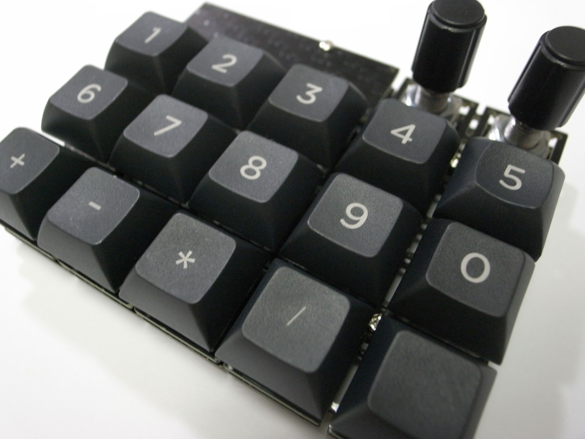
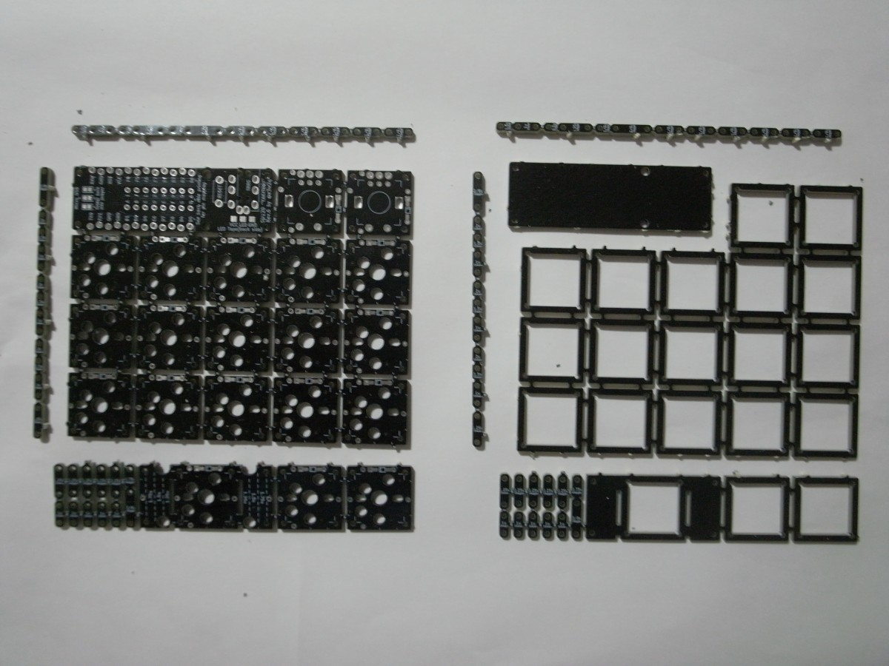
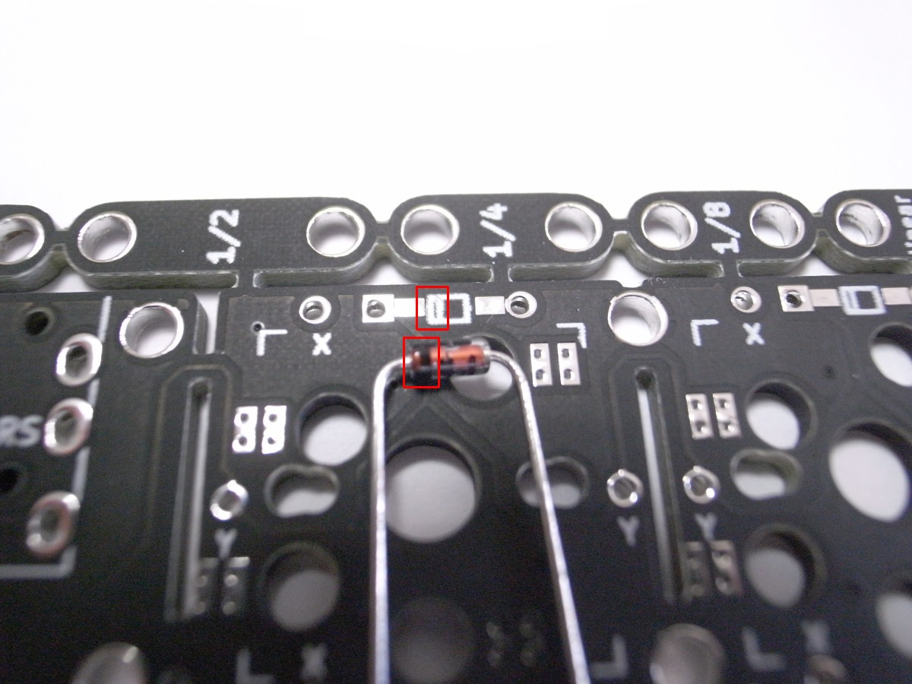
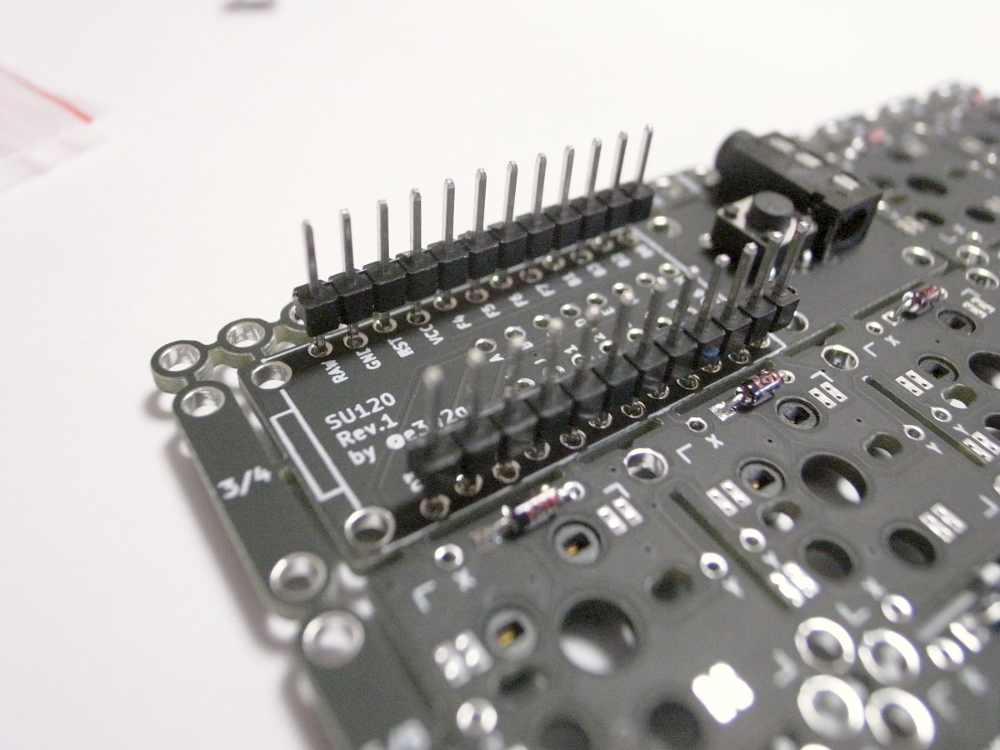
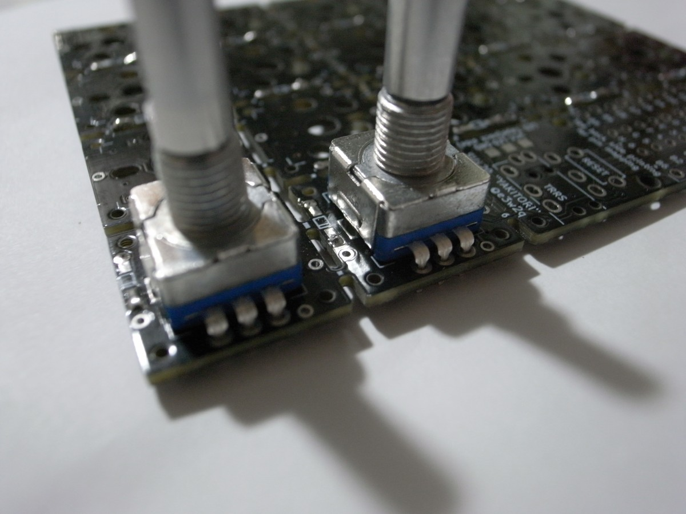
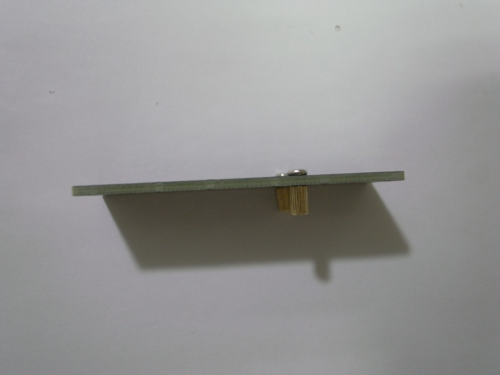
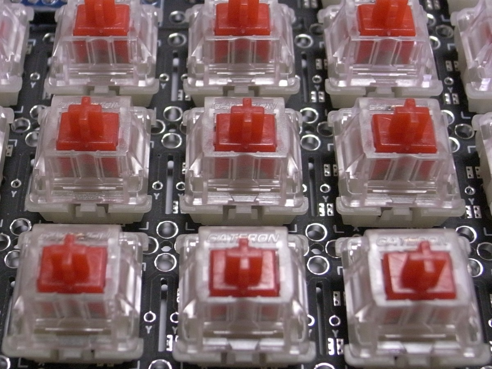
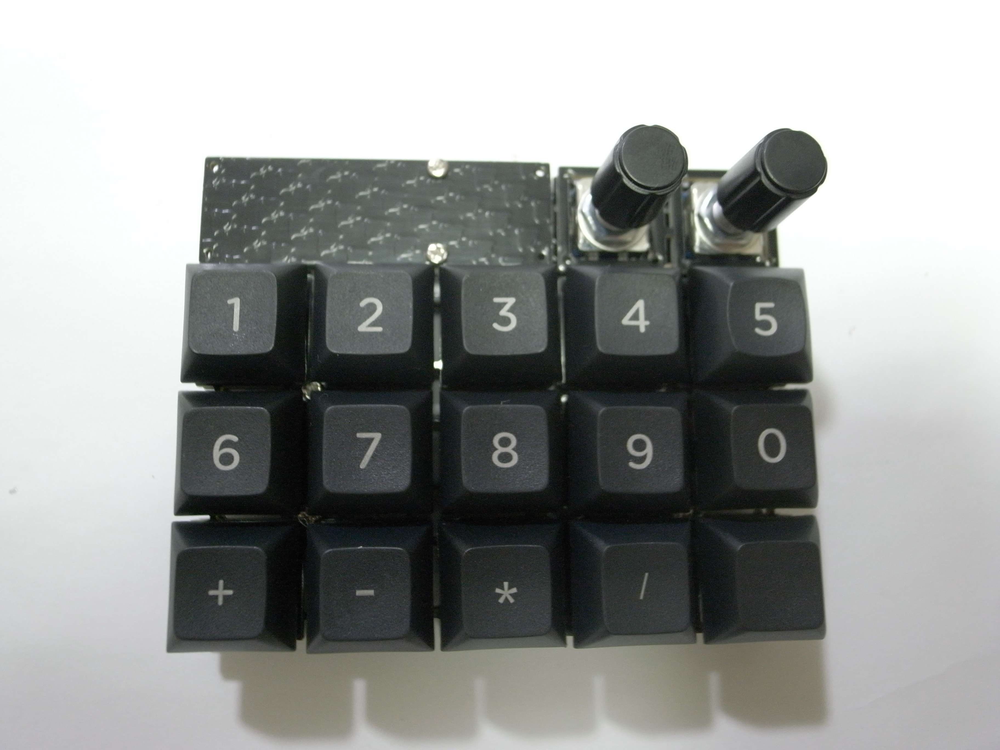

# 15 Key 2 Knob Keypad



## 必要なパーツ
| 名前 | 数 | 備考 | 調達先の例 | 参考価格（送料込） |
|:-|:-|:-|--|--|
| SU120 PCB | 1枚 | [入手方法はこちら](../common/pcb_order_guide_jp.md) | [Elecrow Online Store](https://www.elecrow.com/pcb-manufacturing.html) | 10枚で1,400円($12.94) |
| Pro Micro | 1個 | スルーホールをZigzag仕様にしてあるのでコンスルーではなく普通の付属ピンヘッダを使います | [AliExpress](https://www.aliexpress.com/)で「Pro Micro ATmega32U4 5V 16MHz」を検索 | 290円($2.66) |
| タクトスイッチ 2本足のもの | 1個 | | https://ja.aliexpress.com/item/1068908059.html | 50個で100円($0.90) |
| ダイオード 1N4148 | 17個 | ハンダ付けの難易度は上がりますが表面実装ダイオード(1N4148W)も可 | https://ja.aliexpress.com/item/32729204179.html | 100個で90円($0.80) |
| Dシャフト（平軸） プッシュスイッチ付きロータリーエンコーダー | 2個 |  | https://ja.aliexpress.com/item/32835514781.html | 5個で230円($2.12) |
| Dシャフト ロータリーエンコーダー用キャップ | 2個 |  | https://ja.aliexpress.com/item/4000111239246.html | 10個で110円($1.01) |
| Kailh PCBソケット CherryMX用 または Choc用 | 15個 | | https://yushakobo.jp/shop/a01ps/ | 20個で330円+送料330円 |
| 5ピン仕様のキースイッチ CherryMX用 または Choc用 | 15個 |  | https://yushakobo.jp/product-category/switches/ | 20個で880円～ |
| キーキャップ CherryMX用 または Choc用 | 15個 |  | CherryMX用 https://ja.aliexpress.com/item/32851511530.html | 20個で340円～($6.20～) |
| クッションゴム | 4個 |  | ダイソー クッションゴム 14個入り または すべりどめシート | 110円 |
| Micro USBケーブル | 1本 | 通信ができるもの | ダイソー | 110円 |
| 計 |  |  |  | 4,320円 |
### オプション:トッププレートを付ける場合
| 名前 | 数 | 備考 | 調達先の例 | 参考価格（送料込） |
|:-|:-|:-|--|--|
| SU120 Plate PCB | 1枚 | [入手方法はこちら](../common/pcb_order_guide_jp.md) | [Elecrow Online Store](https://www.elecrow.com/pcb-manufacturing.html) | 10枚で1,400円($12.94) |
| M2ネジ 鍋ネジ ネジ長3mm | 8本 |  | https://ja.aliexpress.com/item/32948978177.html | 100本で85円($0.76) |
| M2スペーサー オス-メス スペーサー長3mm | 4個 |  | https://ja.aliexpress.com/item/33022872348.html | 50個で95円($0.85) |
| M2ナット | 4個 |  | https://ja.aliexpress.com/item/33022872348.html | 100個で65円($0.59) |
| M2スペーサー メス-メス スペーサー長5mm | 2個 |  | https://ja.aliexpress.com/item/33022872348.html | 50個で95円($0.87) |
| 計 |  |  |  | 1,675円 |


## 使用する道具、消耗品

[使用する道具、消耗品](../common/tool_guide_jp.md)を参照ください。

## ビルドガイド

### Pro Microのもげ防止加工

Pro Microにエポキシ接着剤を盛って、簡単にはもげないようにします。

参考1:[ProMicroのモゲ防止ついでにQMK_Firmwareを書き込む - Qiita](https://qiita.com/hdbx/items/2f3e4ddfcadda2a5578e)
参考2:[もげ予防 - Self-Made Keyboards in Japan](https://scrapbox.io/self-made-kbds-ja/%E3%82%82%E3%81%92%E4%BA%88%E9%98%B2)

エポキシ接着剤の2液を混ぜます。


接着剤を付け始める前にMicro USBコネクタを横から見てください。側面に穴が開いています。この穴に接着剤が入ると端子が入らなくなったり、入りにくくなったりします。


この穴を避けて、つまようじなどで接着剤を盛っていきます。


乾くまで置いておきます。

### 基板のカット

下の図のように、ニッパーで切っていきます。トッププレートを付けない場合は左側のみです。



ニッパーで表裏に切れ目を入れてから手で折り割ってください。


### 基板側面のヤスリがけ

机に紙ヤスリを置き、その上で基板のバリがある側面をヤスリがけします。粗目だけでも結構きれいになります。お好みで細目までかけてもよいです。


### ダイオードの取り付け

各キースイッチの端の17箇所にダイオードを取り付けます。

キースイッチの枠が描いてあるほうが基板の表で、Kailh PCBソケットの枠が描いてあるほうが裏です。

ダイオードは、以下の理由で基板の裏に付けることを推奨します

- スタビライザーを装着するキースイッチそばのダイオードを表側に付けるとスタビライザーと干渉する。

- ロープロファイルスイッチでトッププレートを付けたい場合はダイオードを表側に付けると干渉する

  は、ダイオードを裏側に取り付け、表側に出た足をカットしてからハンダ付けしてください。表面実装ダイオードを裏側にハンダ付けしてもいいです。

なお、ロープロファイルスイッチでトッププレートを付けたい場合は、ダイオードの表側に出た足をカットしてからハンダ付けするか、表面実装ダイオードを裏面で使ってください。

ダイオードの足は、指で根本付近を曲げます。はじめに1つだけダイオードを曲げて穴に差し込んでみて、うまくいく曲げ具合を確認して残りのダイオードを同じように曲げてください。

ダイオードの黒くなっている側が、基板の図の二重線の側になるように差し込みます。




全てのダイオードを配置した後、マスキングテープで浮かないようにカバーしておきます。


基板をひっくり返してダイオードを全てハンダ付けし、ニッパーで足を切ります。ダイオードの足を切ってからハンダ付けしても構いません。私はハンダ付けのときに周りの足が邪魔なのと、後がきれいになるので、最近はカットしてからハンダ付けするようにしています。


### PCBソケットの取り付け

基板の裏の印刷された枠に合うようにPCBソケットを配置します。
CherryMX用のPCBソケットを置く場合は、間違った向きに置かないように注意してください。間違った向きに取り付けるとあとでキースイッチが入りません。


PCBソケット両端の金属部分をハンダ付けします。

ハンダ付け不良のリスクを減らすために、事前に片側のみハンダを盛る→ソケットを置いて、ハンダごてで押し付ける→反対側をはんだ付けする、という手順がおすすめです。


### GNDのジャンパ

基板の裏側のジャンパ3箇所をハンダ付けします。**表側にもジャンパがありますが、裏側のみハンダ付けします**。


ハンダを盛ってから間を繋いでください。どうしてもうまくいかない場合はダイオードの切れ端を使って繋いでも構いません。


### リセットスイッチの取り付け

基板の表側からタクトスイッチをはめ込みます。


裏返してハンダ付けします。

### Pro Microの取り付け

基板の表側のPro Micro設置部分の2箇所に、Pro Microに付属している12ピンのピンヘッダの短い側を根本まで差し込みます。



スルーホールがジグザグになっているので、少し入れにくくなっています。ゆっくり押し込んでください。

ピンヘッダにPro Microを差し込みます。**Pro Microの裏面（平らなほう）が上になるように、またマイクロUSBが基板端になるように**します。

**向きを間違えるとリカバリーが大変です。表裏、左右をよく確認してください。**

ニッパーでピンヘッダの足を切ってから、Pro Microとピンヘッダをハンダ付けします。まず四隅をハンダ付けし、横から見てピンヘッダとの間に隙間があれば押さえながらハンダを温めて浮かないようにします。そのあと、順番に全てハンダ付けします。


基板とピンヘッダはジグザグのスルーホールで接触しているため、ハンダ付けは不要です。

### ロータリーエンコーダーの取り付け

表側から差し込み、裏側をはんだ付けします。まずは対角の2箇所をハンダ付けし、傾いている場合はハンダを温めて傾きを解消してから残りの箇所をハンダ付けしてください。



そのあと、ロータリーエンコーダーにキャップを取り付けます。

### トッププレートの取り付け（オプション）

外周から一つ内側の4箇所にM2スペーサー（オス-メス）を差し込み、裏側からM2ナットで留めます。


トッププレートを置き、M2ネジとスペーサーでトッププレートを挟んでネジ留めします。


### カバープレートの取り付け（オプション）

Pro MicroのカバープレートをM2ネジとM2スペーサー5mmで挟んでネジ留めします。

カバープレートは表と裏でデザインが違っているので、好きなほうを表面としてください。



そのあと、基板裏からM2ネジでカバープレートを取り付けます。


### キースイッチの取り付け

表側から差し込みます。キースイッチの足が曲がっている場合はまっすぐにしてから差し込んでください。




### キーキャップの取り付け

キースイッチにキーキャップをはめます。



### ゴム足の取り付け

ゴム足を裏面に取り付けます。ソケットやキースイッチに接触する場合はハサミで切ってから取り付けます。


試打してみて、基板のたわみが気になればゴム足を増やしてください。

### ファームウェアの書き込み

以下のリンク先を参考にして、QMK Firmwareのビルド環境を用意します。
- [Getting Started - QMK Firmware](https://docs.qmk.fm/#/newbs_getting_started)

ビルド環境構築時に持ってくるQMK Firmwareは、フォークした[https://github.com/e3w2q/qmk_firmware/tree/su120](https://github.com/e3w2q/qmk_firmware/tree/su120)とします。または、本家を持ってきて、そこに[https://github.com/e3w2q/qmk_firmware/tree/su120/keyboards/handwired/su120](https://github.com/e3w2q/qmk_firmware/tree/su120/keyboards/handwired/su120)以下をコピーしてもよいです。

用意されたキーマップを書き込むにはqmk_firmwareのフォルダに移動し、以下を実行します。

```
make handwired/su120/rev1_4knob:sasami17:avrdude  
```

**Detecting USB port, reset your controller now...** と表示されたらPro Micro横にハンダ付けしたリセットスイッチを押すと書き込みが始まります。

[KeyboardTester.com](https://www.keyboardtester.com/tester.html)等でキー入力が行えるかテストしてください。